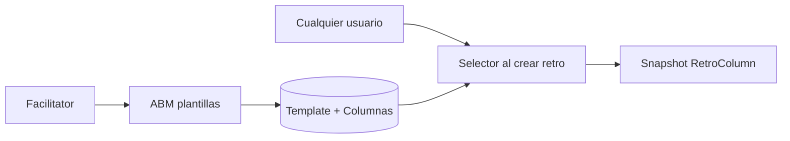

# ABM de plantillas de retrospectiva (en dos etapas)

Las plantillas ya existen como datos de seed de solo lectura ([`Template`](backend/prisma/schema.prisma) + [`TemplateColumn`](backend/prisma/schema.prisma), `GET /api/templates`). No hay rol de admin de app: el ABM queda habilitado para **cualquier usuario que sea facilitator de al menos un equipo**. Las plantillas siguen siendo **globales** (las ven todos al crear una retro).

Esta sesión implementa **solo la Parte 1**. La Parte 2 queda acotada para no pintar contra la pared el modelo.

---

## Parte 1 — ABM simple (implementar ahora)

Campos editables, alineados a lo que ya hay:

- Plantilla: `name`, `description`
- Columnas: `title`, `description`, `icon` (texto/símbolo actual, opcional), `position`

Las 5 plantillas del seed siguen existiendo y pasan a ser editables/borrables.

### Backend

Extraer lógica de [`templates.controller.ts`](backend/src/templates/templates.controller.ts) a un `TemplatesService` y DTOs en `backend/src/templates/dto/templates.dto.ts`.

Endpoints (JWT de usuario, no guests):

- `GET /templates` — igual que hoy (cualquier usuario logueado; lo usa la página de equipo)
- `GET /templates/:id`
- `POST /templates` — solo facilitator
- `PATCH /templates/:id` — solo facilitator; columnas por upsert:
  - con `id` → update
  - sin `id` → create
  - ids omitidos → delete
- `DELETE /templates/:id` — solo facilitator; **bloquear si hay retros** que la referencian (el FK actual no tiene `onDelete`; las columnas de una retro ya son snapshot, pero `templateId` sigue apuntando a la plantilla)

Helper `assertAnyFacilitator(userId)` (existe membresía con `role = facilitator`). Reutilizar el mensaje `Facilitator role required` de [`teams.service.ts`](backend/src/teams/teams.service.ts).

Validación: nombre obligatorio; al menos **1 columna** con título; máximo razonable (p. ej. 8) para no romper el layout del tablero.

**Auth para la UI:** `GET /auth/me`, login y register incluyen `isFacilitator: boolean`. Hoy [`AuthService.me`](backend/src/auth/auth.service.ts) no lo expone.

No hace falta migración de Prisma en esta parte: el schema ya tiene `name`, `description`, `icon`, `position`.

### Frontend

Patrón de páginas standalone + `signal` + forms `ngModel`, igual que [`team.page.ts`](frontend/src/app/pages/team/team.page.ts).

- [`api.service.ts`](frontend/src/app/core/api.service.ts): `getTemplate`, `createTemplate`, `updateTemplate`, `deleteTemplate`
- [`models/index.ts`](frontend/src/app/core/models/index.ts): `User.isFacilitator`
- Rutas con `authGuard` + `facilitatorGuard` (si `!isFacilitator` → dashboard):
  - `/templates` — listado (nombre, descripción, cantidad de columnas, editar / borrar con `confirm`)
  - `/templates/new` y `/templates/:id` — editor
- Nav en [`app.ts`](frontend/src/app/app.ts): link **Plantillas** solo si `auth.user()?.isFacilitator`
- [`AuthService`](frontend/src/app/core/auth.service.ts): persistir `isFacilitator`; al iniciar sesión con usuario, refrescar `/auth/me`; tras crear un equipo, marcar `isFacilitator = true`

Editor de columnas (en la misma pantalla):

- Filas: título, descripción, icono (input corto, placeholder `♥` / `▶`)
- Agregar / quitar columna
- Subir / bajar para `position`
- Preview simple (icono + título + descripción) para ver cómo se lee en el picker actual

El selector de plantilla en la página de equipo **no cambia de comportamiento**: sigue listando todas y copiando columnas al crear la retro.

---

## Parte 2 — después (no implementar ahora)

Queda para un segundo cambio, sobre el ABM ya existente:

1. **Fondo de la retro (estilo Neatro)** — color o imagen en la plantilla; **snapshot en `Retrospective`** al crear para que editar la plantilla no mueva retros vivas. CSS del board hoy es fijo (`--color-sky-soft`).
2. **Defaults de facilitación en la plantilla** — `maxCommentsPerParticipant`, `votesPerParticipant`, `maxVotesPerCard` (y si encaja, anónimos / timer). El form de [`team.page.ts`](frontend/src/app/pages/team/team.page.ts) prefill al elegir plantilla; se puede seguir overrideando.
3. **Logo de columna PNG/SVG** — upload a disco (volumen Docker + estáticos Nest); campo nuevo tipo `logoUrl` **sin reusar** `icon` (el texto/símbolo de la Parte 1 sigue de fallback). El tablero renderiza `` si hay archivo.

Implica migración Prisma, storage y cambios en el board; por eso va separado.
