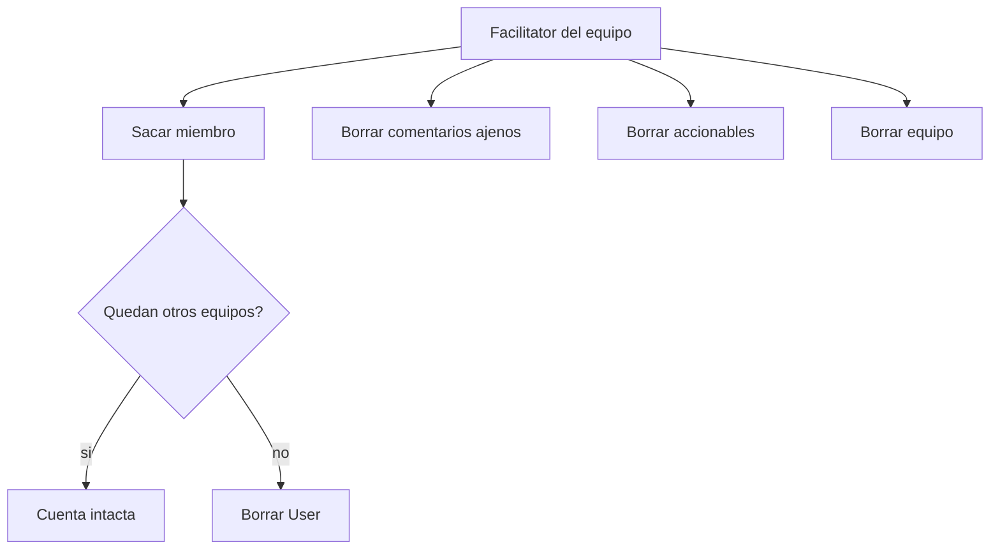

# Controles de admin del facilitator

Permisos **por equipo** (`TeamMember.role === facilitator`). Confirmaciones con `window.confirm()`, igual que borrar retro/plantilla.

## 1. Sacar del equipo y borrar cuenta huérfana

Hoy no hay kick ni delete de usuario. Agregar `DELETE /api/teams/:id/members/:userId` en [`backend/src/teams/teams.controller.ts`](backend/src/teams/teams.controller.ts) y [`teams.service.ts`](backend/src/teams/teams.service.ts).

Reglas:

- Solo facilitator de **ese** equipo.
- No podés sacarte a vos mismo.
- No se puede sacar al **último** facilitator del equipo (sí a otro facilitator si queda al menos uno).
- Tras borrar el `TeamMember`, si el usuario no tiene más membresías: `prisma.user.delete`. En DB ya está `ON DELETE SET NULL` en `Participant.userId` y `ActionItem.ownerId`; los comentarios de retros quedan como autor anónimo/huérfano.
- Respuesta: `{ removed: true, accountDeleted: boolean }`.

UI en [`frontend/src/app/pages/team/team.page.ts`](frontend/src/app/pages/team/team.page.ts): la lista de miembros pasa de badges a filas (nombre, rol, **Sacar**). El botón solo lo ve el facilitator, no en su propia fila. Confirm: *si no está en otro equipo, se borrará su cuenta*.

## 2. Comentarios de invitados y miembros

El backend **ya** deja al facilitator borrar cualquier `Card` en `comments` / `grouping` ([`deleteCard`](backend/src/retros/retros.service.ts)). Falta la UI y que pueda **ver** lo que borra.

Durante Comentarios, `getBoard` oculta las cartas ajenas a todo el mundo (incl. facilitator). Sin eso, “Borrar” sería a ciegas (`•••••`).

- En `getBoard`, no ocultar cartas ajenas si `isFacilitator` del equipo de la retro.
- En `deleteCard`, si es facilitator no exigir `requireParticipant` (hoy un facilitator en modo espectador no puede borrar).
- En [`retro.page.ts`](frontend/src/app/pages/retro/retro.page.ts): separar `canEditCard` (solo propias, sin agrupar) de `canDeleteCard` (propias o `me.isFacilitator`, fases tempranas, no la carta sintética de grupo).
- En [`retro.page.html`](frontend/src/app/pages/retro/retro.page.html): Editar solo con `canEditCard`; Borrar con `canDeleteCard`.

Sin cambios de fase: sigue bloqueado desde votación en adelante.

## 3. Borrar accionables

`DELETE /api/actions/:actionId` ya existe y hoy lo puede **cualquier miembro**. Restringirlo a facilitator en [`backend/src/actions/actions.service.ts`](backend/src/actions/actions.service.ts) (`assertFacilitator`).

Frontend: `deleteAction` en [`api.service.ts`](frontend/src/app/core/api.service.ts). En [`actions.page.ts`](frontend/src/app/pages/actions/actions.page.ts), botón **Borrar** en cada item si el usuario es facilitator del equipo (misma lógica que `team.page.ts`). Confirmación. El tablero de acciones es el único lugar (el panel de pendientes del dashboard sigue siendo lectura).

## 4. Borrar equipos

`DELETE /api/teams/:id` ya es facilitator-only. Falta cliente y UI.

- `deleteTeam` en `ApiService`.
- En la página del equipo, zona de peligro al final: **Borrar equipo**, confirmando que se van retros, miembros y acciones (CASCADE).
- Al éxito: `GET /auth/me` para refrescar `isFacilitator` (si era su único equipo facilitator, desaparece Plantillas) y navegar al panel.

## Archivos

- [`backend/src/teams/teams.controller.ts`](backend/src/teams/teams.controller.ts) / [`teams.service.ts`](backend/src/teams/teams.service.ts)
- [`backend/src/actions/actions.service.ts`](backend/src/actions/actions.service.ts)
- [`backend/src/retros/retros.service.ts`](backend/src/retros/retros.service.ts)
- [`frontend/src/app/core/api.service.ts`](frontend/src/app/core/api.service.ts)
- [`frontend/src/app/pages/team/team.page.ts`](frontend/src/app/pages/team/team.page.ts)
- [`frontend/src/app/pages/actions/actions.page.ts`](frontend/src/app/pages/actions/actions.page.ts)
- [`frontend/src/app/pages/retro/retro.page.ts`](frontend/src/app/pages/retro/retro.page.ts) / [`retro.page.html`](frontend/src/app/pages/retro/retro.page.html)
- [`frontend/src/app/core/auth.service.ts`](frontend/src/app/core/auth.service.ts) — refrescar `isFacilitator` tras borrar equipo

## Fuera de alcance

- Expulsar invitados de una retro (no son `TeamMember`).
- Borrar comentarios agrupados como pila (la carta de grupo es sintética; se puede borrar cada carta suelta).
- Dejar el equipo uno mismo, cambiar roles, o admin global.

## Verificación en browser

- Facilitator: sacar un miembro que está en otro equipo (cuenta sigue) vs. uno solo de este (cuenta desaparece; no puede loguear).
- No sacar al último facilitator ni a uno mismo.
- Miembro: no ve Sacar / Borrar equipo / Borrar acción.
- Retro en Comentarios: facilitator ve cartas ajenas y las borra (invitado y miembro); en Agrupación igual en cartas no agrupadas; en Votación no.
- Autor sigue pudiendo borrar/editar las propias en fases tempranas.
- Borrar acción en el kanban; borrar equipo y volver al panel.
