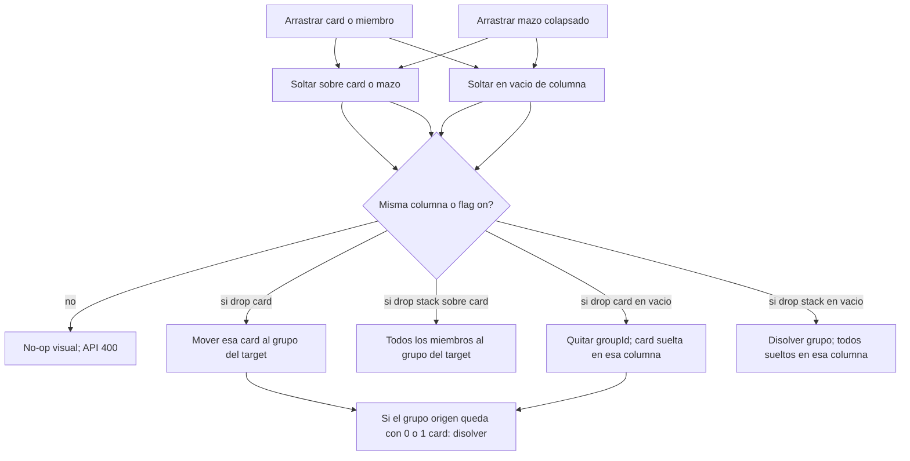

# Agrupar, cambiar de grupo y desagrupar por drag-and-drop

## Decisión

- En fase `grouping`, el agrupado es **solo** por arrastre (se elimina el flujo de dos clicks).
- Se puede arrastrar **cualquier tarjeta**, incluida una que ya está en un grupo.
- Soltar **sobre otra tarjeta o mazo** = unir / cambiar de grupo.
- Soltar **en el vacío de una columna** = dejarla suelta (desagrupar si venía de un grupo).
- Mazo **colapsado** se arrastra como unidad (merge o disolver). Mazo **expandido**: cada miembro se arrastra solo.
- **Por defecto no se mezclan columnas (temas).** Agrupar, cambiar de grupo, desagrupar o mover queda **dentro de la misma columna**.
- Flag `allowCrossColumnGrouping` (default `false`) al crear la retro; el facilitador también lo puede cambiar en ajustes.
- Dependencia: `@angular/cdk` (Angular 22), la misma que prevé el [plan Neatro](plan_accionables_neatro_f6260e23.plan.md).

## Gestos



Reglas:

- Participantes únicamente; `r.status === 'grouping'`; sin `editingCardId`.
- Mismo grupo: drop de un miembro sobre otro del mismo mazo = no-op.
- Con `allowCrossColumnGrouping === false` (default): drop lists **no conectados** entre columnas; el backend rechaza source/target o `columnId` distintos.
- Con el flag en `true`: el source toma `columnId` del target (grupo) o de la columna vacía.
- Card suelta dropeada en el vacío de **su** columna: no-op (no reordenar).
- Chevron sigue expandiendo/colapsando el mazo para poder sacar un miembro.

## Setting: no mezclar temas

Las columnas son temas a propósito. Mezclar cards de distinto tema no tiene sentido salvo que el equipo lo pida.

En [`Retrospective`](backend/prisma/schema.prisma):

```prisma
allowCrossColumnGrouping Boolean @default(false)
```

Migración Prisma nueva. **No** se agrega al `Template`: se elige al crear cada retro.

- [`CreateRetroDto`](backend/src/retros/dto/retros.dto.ts) / [`UpdateSettingsDto`](backend/src/retros/dto/retros.dto.ts): `allowCrossColumnGrouping?: boolean`.
- [`create`](backend/src/retros/retros.service.ts): `dto.allowCrossColumnGrouping ?? false`.
- [`updateSettings`](backend/src/retros/retros.service.ts): persistir y emitir en `settings-changed`.
- Board payload y modelos frontend (`RetrospectiveBoard`, `CreateRetroPayload`).

UI (mismo patrón que anónimos):

- Crear retro en [`team.page.ts`](frontend/src/app/pages/team/team.page.ts): checkbox **apagado** — “Permitir agrupar tarjetas entre columnas”. Hint corto: las columnas son temas distintos.
- Ajustes de facilitación en [`retro.page.html`](frontend/src/app/pages/retro/retro.page.html): el mismo checkbox, por si hace falta durante la sesión.

## Backend de agrupado

Hoy [`groupCards`](backend/src/retros/retros.service.ts) ya setea `source.groupId` al del target aunque el source ya tenga grupo, **mueve de columna** y **no** limpia el `CardGroup` origen. No hay ungroup.

Helper compartido `assertSameColumnUnlessAllowed(retro, sourceColumnId, destColumnId)`: si el flag está off y las columnas difieren → `BadRequestException('Solo se pueden agrupar tarjetas de la misma columna')`.

### 1. Helper `dissolveIfOrphan(groupId)`

Tras mover o desagrupar, si el grupo queda con:

- **0 cards**: borrar el `CardGroup`.
- **1 card**: `groupId = null` en esa card y borrar el `CardGroup` (un grupo de uno no existe).

Votos no aplican en esta fase. `ActionItem.groupId` es `onDelete: SetNull`; `Vote.groupId` es Cascade.

### 2. Extender `groupCards` (una card)

- `assertSameColumnUnlessAllowed` entre source y target.
- Si source y target ya comparten `groupId`: no-op.
- Mover **solo** `source` al grupo del target (crear grupo si el target está suelto), `columnId` + `position` como hoy.
- Guardar `oldGroupId` del source y llamar `dissolveIfOrphan(oldGroupId)`.

### 3. Merge de mazo (unidad)

Cuando el frontend arrastra un mazo colapsado, manda `{ sourceCardId, targetCardId, moveGroup: true }`.

- Extender [`GroupCardsDto`](backend/src/retros/dto/retros.dto.ts) con `moveGroup?: boolean`.
- Misma validación de columna.
- Si `moveGroup` y el source tiene `groupId`: pasar **todos** los miembros de ese grupo al grupo del target; borrar el `CardGroup` origen.
- Si el source está suelto, `moveGroup` se ignora (mismo path que una card).

### 4. `POST /retros/:id/ungroup`

Body: `{ cardId, columnId?, ungroupAll?: boolean }`.

- Fase grouping + participante.
- Destino = `columnId` o la columna actual de la card. `assertSameColumnUnlessAllowed`.
- `ungroupAll` (mazo colapsado al vacío): todas las cards del grupo quedan `groupId: null` en esa columna; se borra el `CardGroup`.
- Sin `ungroupAll`: una card `groupId: null`; `dissolveIfOrphan` del grupo origen.
- `position`: al final de las cards sueltas de esa columna.
- Evento `card-updated` (o recarga vía `getBoard` como hoy).

Cliente: `ungroupCards()` en [`api.service.ts`](frontend/src/app/core/api.service.ts).

## Frontend DnD

### 1. Dependencia

[`frontend/package.json`](frontend/package.json): `@angular/cdk@^22`.

### 2. CDK en el board

[`retro.page.ts`](frontend/src/app/pages/retro/retro.page.ts), [`retro.page.html`](frontend/src/app/pages/retro/retro.page.html), [`retro.page.scss`](frontend/src/app/pages/retro/retro.page.scss).

- Cada `.cards` de columna es `cdkDropList` (`data: { kind: 'column', columnId }`, sorting disabled). Drop acá = ungroup / mover suelta.
- Cada card suelta, cada **miembro visible** del mazo y el mazo colapsado son `cdkDropList` + `cdkDrag` (`data` con `kind: 'card' | 'stack'`, `cardId`, `groupId`, `columnId`).
- Conexión: si el flag está off, `cdkDropListConnectedTo` **solo** listas de la misma columna (no un `cdkDropListGroup` global). Si está on, grupo global como en el diseño anterior.
- `[cdkDragDisabled]` fuera de grouping / espectador / editando.
- `cdkDropListDropped`:
  - destino card/stack + origen card → `groupCards(source, target)`
  - destino card/stack + origen stack → `groupCards(header, target, { moveGroup: true })`
  - destino columna + origen card → `ungroup` de esa card
  - destino columna + origen stack → `ungroup` con `ungroupAll`
  - mismo contenedor / mismo grupo / distinta columna con flag off: no-op
- En grouping el chevron sigue mostrando todos los miembros para poder arrastrarlos uno a uno.

### 3. Quitar click-to-group

- Sacar agrupado de `onBoardCardClick` / `selectForGroup`.
- Eliminar `selectedCardId`, `isGroupTarget`, chip flotante, hints de “Selecciona dos…”, Escape de selección, clases `.selected` / `.group-target` de selección.
- Hint: *“Arrastrá una tarjeta sobre otra de la misma columna para agrupar. Soltala en el vacío para dejarla suelta.”*

### 4. Preview y highlight

- Preview sticky compacto.
- Highlight distinto: anillo en la **card** destino vs fondo en la **columna** (desagrupar). Otras columnas no se iluminan si el flag está off.

## Fuera de alcance

- Reordenar sueltas dentro de la misma columna.
- Flag a nivel plantilla.
- DnD del Kanban de acciones (sigue en el plan Neatro).
- Ungroup por botón (el gesto es el drop en el vacío).

## Verificación

- Default (flag off): dos sueltas de la **misma** columna → mazo; no se puede soltar sobre otra columna ni agrupar entre temas.
- Flag on: agrupar / mover / desagrupar cross-column funciona.
- Expandir mazo, arrastrar un miembro a otro mazo de la misma columna → cambia de grupo; el origen se disuelve si queda 1.
- Miembro al vacío de **su** columna → suelta.
- Mazo colapsado sobre otra card → merge de todos.
- Mazo colapsado al vacío → todas sueltas.
- Click ya no agrupa; chevron/edit/delete OK; espectador sin drag.
- Rebuild Docker `web` + `api`; hard refresh en `http://localhost:8090`.
