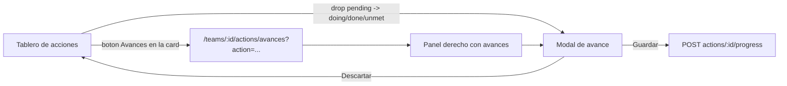

# Avances de accionables

## Decisiones cerradas

- Modal solo al mover **desde `pending`** hacia `doing` / `done` / `unmet`. Otros movimientos no lo disparan.
- "Modo de ingreso": select con `Retrospectiva`, `Weekly`, `Planning`, `Refinamiento`, `Otro`; al elegir `Otro` aparece un input para texto libre.
- Nav: `Acciones` pasa a grupo colapsable con `Tablero` y `Avances` (ruta propia), como en la captura.
- Permisos del avance = permisos del accionable (herencia vía `assertCanMutateAction`).
- El título se persiste al crear (`Actualización de avances N°{sequence}`); borrar un avance **no** renumera los demás.
- Layout validado en [el mockup](/Users/macbook/.cursor/projects/Users-macbook-Documents-retrokit/canvases/avances-accionables.canvas.tsx): panel derecho **siempre visible** con el primer accionable de la retro preseleccionado, y lista izquierda **plana** con punto de color por estado.



## 1. Schema + migración

En [backend/prisma/schema.prisma](backend/prisma/schema.prisma):

```prisma
enum ActionEntryMode {
  retrospectiva
  weekly
  planning
  refinamiento
  otro
}

model ActionProgressUpdate {
  id              String          @id @default(cuid())
  actionId        String
  authorId        String?
  sequence        Int
  title           String
  entryMode       ActionEntryMode
  entryModeCustom String?
  progress        String?
  pending         String?
  createdAt       DateTime        @default(now())
  updatedAt       DateTime        @updatedAt
  action          ActionItem      @relation(fields: [actionId], references: [id], onDelete: Cascade)
  author          User?           @relation("ActionProgressAuthor", fields: [authorId], references: [id], onDelete: SetNull)

  @@unique([actionId, sequence])
  @@index([actionId, createdAt])
}
```

Más backrefs: `ActionItem.progressUpdates`, `User.progressUpdates`. Migración nueva en `backend/prisma/migrations/20260916120000_action_progress_updates/` (corre en el entrypoint de `api`).

## 2. API

Extender el módulo de acciones ([backend/src/actions](backend/src/actions)) con un `ActionProgressService` + rutas en [actions.controller.ts](backend/src/actions/actions.controller.ts):

- `GET /actions/:actionId/progress` — `assertMemberOrAdmin` del team de la acción; orden `sequence asc`.
- `POST /actions/:actionId/progress` — `assertCanMutateAction`; `sequence = max(sequence) + 1` dentro de una transacción; `title = 'Actualización de avances N°' + sequence`; `authorId = userId`.
- `PATCH /action-progress/:id` y `DELETE /action-progress/:id` — resuelven la acción padre y usan el mismo `assertCanMutateAction` (herencia de permisos).

DTOs nuevos en [dto/action.dto.ts](backend/src/actions/dto/action.dto.ts): `entryMode` (`IsIn` del enum), `entryModeCustom` (requerido con `ValidateIf` cuando `entryMode === 'otro'`, max 120), `progress` / `pending` (`MaxLength(4000)`), y validación de que al menos uno de los dos tenga contenido.

En [backend/src/common/action-item.ts](backend/src/common/action-item.ts): sumar `_count: { select: { progressUpdates: true } }` a `actionItemInclude` y exponer `progressCount` en `serializeActionItem` (badge en el tablero y contador en la lista de Avances). Serializador propio para el avance con `author` (usa `userOwnerSelect`).

Realtime vía [RealtimeEventsService.emitToTeam](backend/src/realtime/realtime-events.service.ts): `action-progress-created` / `-updated` / `-deleted` con `{ actionId, teamId, update }`.

## 3. Frontend compartido

- [models/index.ts](frontend/src/app/core/models/index.ts): `ActionEntryMode`, `ActionProgressUpdate`, `ACTION_ENTRY_MODE_LABELS`, `progressCount?` en `ActionItem`.
- [api.service.ts](frontend/src/app/core/api.service.ts): `listActionProgress`, `createActionProgress`, `updateActionProgress`, `deleteActionProgress`.
- Nuevo `frontend/src/app/core/action-permissions.ts` con `canMutateAction(item, user, team)` extraído de [actions.page.ts](frontend/src/app/pages/actions/actions.page.ts) (`isFacilitator()` + `createdById === yo || ownerId === yo`), para reusar en las dos páginas.
- Nuevo `frontend/src/app/shared/action-progress-modal.component.ts`, con el mismo patrón que [action-item-modal.component.ts](frontend/src/app/shared/action-item-modal.component.ts): encabezado con el título previsto y la fecha del día, select Modo de ingreso + input custom para `Otro`, textareas Avances y Pendientes, botones `Descartar` / `Guardar avance`. Modo edición reusa el mismo componente con el título ya existente.

## 4. Tablero de acciones

En [actions.page.ts](frontend/src/app/pages/actions/actions.page.ts):

- En `move()`, tras el `PATCH` exitoso, si `previousStatus === 'pending' && status !== 'pending'` abrir el modal de avance para esa acción. Descartar no revierte el movimiento.
- Botón nuevo en `.item-actions` (icono de chat + badge con `progressCount`) que navega a `/teams/:id/actions/avances` con `?action=<id>&retro=<retroId|__none__>`. Visible para cualquier miembro (la vista es de lectura para quien no puede mutar).

## 5. Vista Avances

Nueva página `frontend/src/app/pages/actions/action-progress.page.ts`, ruta `teams/:id/actions/avances` con `authGuard` en [app.routes.ts](frontend/src/app/app.routes.ts).

- Header: filtro de retro idéntico al del tablero (`Todas las retros` / retros / `Sin retro`), default `team.retrospectives[0]` y override por `?retro=`.
- Layout dos columnas (`grid-template-columns: minmax(0, 18rem) minmax(0, 1fr)`, una sola columna abajo de 900px): izquierda lista **plana** de accionables de la retro filtrada, ordenada como el tablero, con título, punto de color por estado, owner y contador de avances; derecha panel de detalle **siempre visible**, con el primer accionable de la lista preseleccionado.
- Panel derecho: cabecera con título del accionable, estado, owner, due date y contador, botón `Agregar avance`, y los avances del más nuevo al más viejo separados por divisores (no tarjetas anidadas), cada uno con título, fecha, autor, chip del modo de ingreso y los bloques Avances / Pendientes. Editar/borrar por avance solo si `canMutateAction`, con `confirm()` para borrar (mismo patrón que el tablero). Accionable sin avances: texto que aclara que el modal también se abre al sacarlo de Pendiente en el tablero.
- El accionable seleccionado queda remarcado (`aria-selected`, borde `--color-brand` + fondo `--color-sky-soft` y un `translateX(2px)`) y el panel derecho reentra con animación al cambiar de selección. Animaciones **solo CSS**, siguiendo el idiom de `@keyframes app-toast-in` en [styles.scss](frontend/src/styles.scss): fade + slide del panel, `transition` en el highlight del ítem, `min-height` en el panel para que la lista no salte. Sin `@angular/animations`.
- El título y la fecha del avance son de solo lectura en el modal, con una línea que aclara que los pone el sistema.
- Query params sincronizados con `router.navigate(..., { replaceUrl: true })` para que el deep link del tablero funcione y sea compartible.
- Sockets: join al room del equipo y escucha de `action-updated` / `action-deleted` (ya existentes) + los tres `action-progress-*`.

## 6. Nav rail

En [app-nav-rail.component.ts](frontend/src/app/shared/app-nav-rail.component.ts): reemplazar el link único `Acciones` por un grupo colapsable (botón con chevron, `aria-expanded`) con los hijos `Tablero` (`/teams/:id/actions`) y `Avances` (`/teams/:id/actions/avances`). Se abre automáticamente cuando la URL matchea una ruta de acciones; con el rail colapsado se muestran los dos ítems como iconos sueltos, sin el header del grupo. Replicar el estado disabled cuando no hay equipo activo.

## Fuera de alcance

- Avances desde la fase `actions` de la retro (solo tablero y vista Avances).
- Renumerar títulos al borrar un avance.
- Adjuntos o imágenes en los avances.
- Exponer avances en el report de la retro.

## Cierre

Rebuild `docker compose up -d --build web api` y avisar **http://localhost:8090**. El plan queda en `.cursor/plans/` con `isProject: true`.
