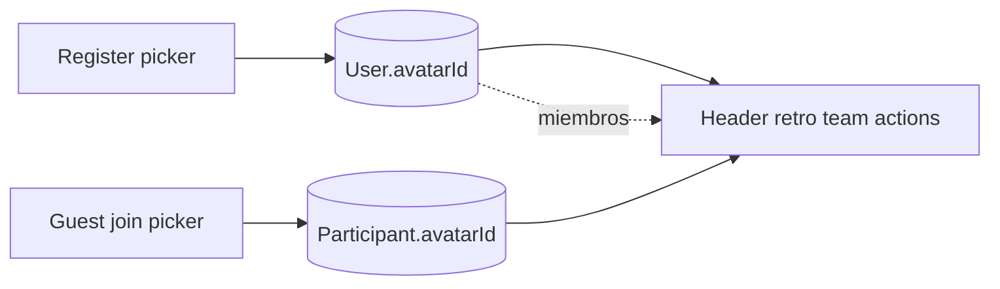

# Avatares tipo meme

Idea tomada de [Make it Meme](https://makeitmeme.com/es/): al entrar elegís un personaje de una grilla y esa cara te representa en la sala. En Retrokit hoy la identidad es solo texto (`User.name` / `Participant.guestName`); no hay foto ni color.

No vamos a copiar el arte de Make it Meme ni personajes con copyright (Pepe, Wojak, Doge, “this is fine”, celebridades). El pack es un **elenco original** de caras de reacción (oficina / retro), con el mismo UX de galería.

## Pack (assets)

- ~24 SVG circulares 128×128 en [`frontend/public/avatars/`](frontend/public/avatars/), stroke grueso, paleta plana, expresiones exageradas.
- Catálogo único en frontend [`frontend/src/app/core/avatars.ts`](frontend/src/app/core/avatars.ts) y allowlist en backend [`backend/src/common/avatars.ts`](backend/src/common/avatars.ts) (misma lista de ids; no un paquete compartido).
- Ids estables (`cafe`, `fuego`, `clap`, `zen`, `caos`, `sleepy`, `nerd`, `star`, `sideeye`, `rubberduck`, `rocket`, `plant`, `sticky`, `party`, `grumpy`, `crylaugh`, `cool`, `shocked`, `thinking`, `capy`, `ghost`, `robot`, `wizard`, `cat`). Labels en español.
- Helpers: `avatarSrc(id)`, `isAvatarId(id)`, `avatarForSeed(seed)` (hash → id) para usuarios viejos sin elegir.
- Sin llamadas a DiceBear ni a terceros.

## Datos

En [`backend/prisma/schema.prisma`](backend/prisma/schema.prisma):

- `User.avatarId String?`
- `Participant.avatarId String?` — solo invitados. Los miembros dejan `null` y se resuelve desde `User`.

Migración `20260910160000_user_avatars` (mismo estilo que [`20260910120000_votes_ready`](backend/prisma/migrations/20260910120000_votes_ready/migration.sql)).

Resolución (backend y frontend):

`avatarId = participant.avatarId ?? participant.user?.avatarId ?? avatarForSeed(participant.id | user.id)`

Tarjetas anónimas o `hidden` en comentarios: **sin avatar** (no filtrar identidad).

## Backend

- [`RegisterDto`](backend/src/auth/dto/auth.dto.ts): `avatarId?` validado contra la allowlist. Si falta, `avatarForSeed(user.id)` post-create (o random y persistir).
- Login / `GET /auth/me` / `tokenResponse`: incluir `avatarId`. Invitados: agregar `avatarId` al JWT en `signGuest` y devolverlo en `/auth/me`.
- `PATCH /auth/me` `{ avatarId }` (usuarios registrados). Sirve para cuentas existentes y para cambiar después.
- [`JoinRetroDto`](backend/src/retros/dto/retros.dto.ts): `avatarId?`. En join de invitado se guarda en `Participant`. Miembro autenticado no re-elige.
- [`getBoard`](backend/src/retros/retros.service.ts): `user.select` + `owner.select` con `avatarId`. Exponer `avatarId` resuelto en `participants`, `commentProgress`, `voteProgress`, y `authorAvatarId` en cards (null si anónima/hidden).
- Mismos `select` en [`teams.service.ts`](backend/src/teams/teams.service.ts) y [`actions.service.ts`](backend/src/actions/actions.service.ts).

## Frontend

Componentes standalone en `frontend/src/app/shared/`:

- `UserAvatarComponent`: `` circular, tamaños `sm` (24) / `md` (32) / `lg` (48), `alt` = nombre.
- `AvatarPickerComponent`: grilla, anillo brand en el seleccionado, botón “Otro al azar”. Preselección random al abrir.

Dónde se elige (lo que pediste):

- [`register.page.ts`](frontend/src/app/pages/register/register.page.ts): picker debajo del nombre; el card pasa a ~540px.
- [`join.page.ts`](frontend/src/app/pages/join/join.page.ts): solo flujo invitado. Miembro logueado sigue “Entrar a la sala” con el avatar de la cuenta.

Dónde se ve:

- Header en [`app.ts`](frontend/src/app/app.ts) (click en usuarios registrados abre popover + `PATCH /auth/me`; invitados solo muestran).
- Retro: chips de participantes, filas de listos, autor de sticky.
- Equipo, dueños de acciones (tablero, dashboard, actions, report).

Modelos en [`frontend/src/app/core/models/index.ts`](frontend/src/app/core/models/index.ts): `avatarId` en `User`, `Participant.user`, progress, `ActionItem.owner`, `authorAvatarId` en `Card`.

[`auth.service.ts`](frontend/src/app/core/auth.service.ts): persistir `avatarId` en register/login/`setGuestToken`/`ensureMe`. [`api.service.ts`](frontend/src/app/core/api.service.ts): `joinRetro(..., avatarId)` y `updateMe({ avatarId })`.

## Fuera de alcance

- Subir foto, avatares premium, arte de terceros.
- Re-elegir avatar en cada retro si ya tenés cuenta (sí podés cambiarlo desde el header).
- Socket `avatar-changed`: el resto lo ve en el próximo reload del board.

## Verificación (browser)

- Register: elegir cara, verla en el header y en el equipo.
- Invitado: elegir otra cara al join; aparece en participantes, listos y stickies.
- Comentario anónimo / fase comentarios (`hidden`): sin cara.
- Usuario viejo sin `avatarId`: cara determinística; se puede cambiar desde el header.
- Miembro que entra con código de miembro: no pide picker; usa el de la cuenta.
