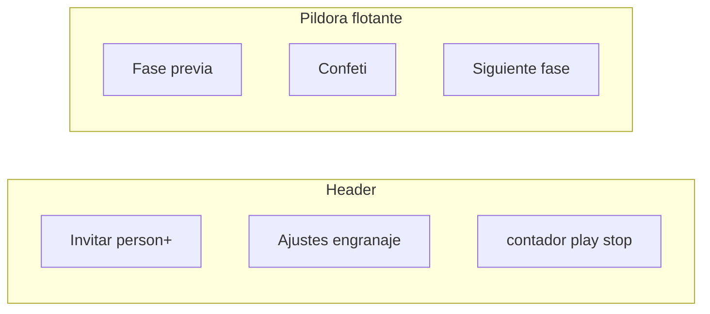

# Barra flotante y chrome de la retro

Hoy el footer de facilitación ([`.facilitator-bar`](frontend/src/app/pages/retro/retro.page.scss)) es una franja full-width con un solo **Siguiente fase**. El header mezcla 🎉, countdown, **Invitar**, **Ajustes**, select de duración, Iniciar/Stop y Borrar. Todo el cambio es frontend en [`retro.page.html`](frontend/src/app/pages/retro/retro.page.html), [`retro.page.scss`](frontend/src/app/pages/retro/retro.page.scss) y [`retro.page.ts`](frontend/src/app/pages/retro/retro.page.ts). Sin backend ni librería de iconos: SVG inline al estilo del topbar en [`app.ts`](frontend/src/app/app.ts).

## Píldora flotante (estilo Neatro)

Reemplazar la barra full-width por un dock centrado, `position: fixed`, radio píldora, sombra, `z-index` 30 (debajo de toasts/modales). No pegada a los bordes.

Tres slots:

- Izquierda: fase anterior (flecha + nombre, p. ej. `← Comentarios`)
- Centro: botón de confeti (el 🎉 que hoy está en el header)
- Derecha: fase siguiente (nombre + flecha, p. ej. `Votar →`)

Nombres desde [`PHASES` / `PHASE_LABELS`](frontend/src/app/core/models/index.ts). Agregar `prevPhase` (espejo de `nextPhase`). Reusar `goToPhase()`.

- Solo el **facilitator** activa prev/next.
- El resto ve la misma píldora (confeti al centro; laterales vacíos o labels no clickeables para no desalinera el 🎉).
- En la primera fase no hay prev. En ROTI: sí prev (volver a Plan de acción), no next hacia `closed` (eso sigue siendo Enviar ROTI).
- La nav de fases de arriba no se toca.
- Padding inferior del shell para todos (no solo facilitator), y subir un poco copy/group toasts para que no tapen el dock.

### Color y tamaño

La píldora usa el mismo chrome que **Tus comentarios: 5/8** en tablero con imagen: `background: color-mix(in srgb, var(--color-bg) 88%, transparent)`, borde `--color-border`, texto `--color-text`. No el invertido `color-text` / `color-bg`.

Más chica que el primer corte: `width: max-content` (no 36rem), padding y botones más compactos, confeti ~2rem. En mobile se siguen ocultando los nombres de fase.

## Header: iconos y timer

Quitar el confeti del header.

Agrupar a la derecha:

1. **Invitar** (no espectadores): icon-only persona + `+`, `title` / `aria-label`. Abre un **modal** (mismo patrón que join: backdrop, click afuera, Escape, Cerrar), no un panel inline.
2. **Ajustes** (facilitator): icon-only engranaje, al lado de Invitar. También modal. No abrir los dos a la vez.
3. **Timer** (facilitator): countdown + play + stop. Si no hay timer corriendo, el número muestra la duración elegida (`timerSeconds`) formateada con `formatTime()`. Play/stop con `aria-label` Iniciar/Detener. El select de 5/10/15 min queda compacto junto al cluster (también está en Ajustes).
4. Participantes no-facilitator: si hay timer activo, el countdown sigue visible en el header (sin play/stop).
5. **Sin Borrar retro** en el tablero: alcanza el de la página del equipo.

## Logos de columna

Los PNG ya se exportan con alpha ([`image-crop-modal`](frontend/src/app/shared/image-crop-modal.component.ts) solo pinta blanco en backgrounds). El recuadro blanco en el board es CSS: [`.col-logo { background: rgba(255,255,255,0.7) }`](frontend/src/app/pages/retro/retro.page.scss). Sacarlo (y el fondo muted del editor de plantillas) para que se vea el PNG transparente.

## Verificación

Rebuild `web`, hard refresh en `http://localhost:8090`. Facilitator: prev/next, confeti, engranaje/invitar en modal, play/stop + contador, sin borrar. Participante: píldora con confeti, invitar modal, countdown si corre el timer. Espectador: confeti, sin invitar/ajustes/timer. Logos sin caja blanca. Píldora chica, mismo fondo que Tus comentarios. Mobile: no tapa el composer; labels largas no desbordan.
