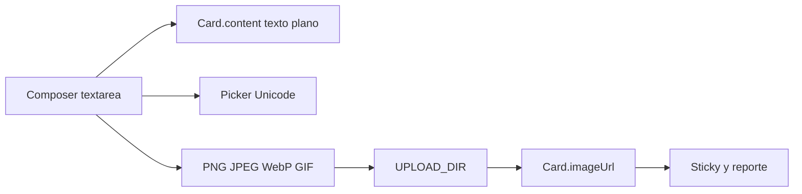

# Composer que crece + emojis e imagen/GIF

Hoy el composer y el edit de [`retro.page.html`](frontend/src/app/pages/retro/retro.page.html) son `<textarea rows="2">` sin auto-resize. El contenido de la card es **texto plano** (`Card.content`), se renderiza con `{{ card.content }}` (seguro frente a XSS) y **no hay uploads** en el API.

## Evaluación (y recorte)

- **Auto-grow:** viable ya, solo frontend.
- **Emojis:** viable ya. Unicode ya se puede pegar; un picker inserta el mismo string. No hace falta contenteditable ni librería pesada.
- **Imágenes / GIFs:** viable con **un adjunto por comentario** (archivo local). No hay Multer ni volumen hoy; hay que armarlo. **Giphy/Tenor queda fuera:** Retrokit se sirve en un servidor local y pediría API key + red externa.
- **No** rich text / HTML en `content`. El texto sigue siendo plano; la media va en `imageUrl`.

---

## 1. Auto-grow + saltos de línea

Directiva standalone `autosizeTextarea` en [`frontend/src/app/shared/autosize-textarea.directive.ts`](frontend/src/app/shared/autosize-textarea.directive.ts):

- `resize: none`; altura = `scrollHeight` en `input` y al setear valor (editar una card larga).
- Mínimo ~2 filas; **máximo ~12rem** y ahí sí scroll interno, para que un párrafo largo no coma la columna.
- Aplicarla al composer y al textarea de edición (no al ROTI).

En `.sticky p`: `white-space: pre-wrap` para que los enters se vean en el tablero (hoy se colapsan).

---

## 2. Picker de emojis

Componente chico `EmojiPicker` (botón 😊 + popover con una grilla fija de ~80 emojis útiles para retros). Al elegir, inserta en `selectionStart` del textarea y actualiza el `ngModel`.

Sin dependencias npm. Cerrar al click afuera / Escape.

---

## 3. Storage de archivos (base reutilizable)

Módulo chico [`backend/src/uploads/`](backend/src/uploads/) (después lo pueden usar plantillas):

- `UPLOAD_DIR` (env, default `./uploads`), archivos en `cards/{retroId}/{uuid}.{ext}` (nunca el nombre original).
- Estáticos en **`/api/uploads/...`** en [`main.ts`](backend/src/main.ts) (nginx ya proxya `/api/`).
- Volumen Docker `uploads_data` en el servicio `api` + `UPLOAD_DIR=/app/uploads` en [`docker-compose.yml`](docker-compose.yml) y [`.env.example`](.env.example). Crear el dir en el entrypoint.

Límites:

- MIME: `image/png`, `image/jpeg`, `image/webp`, `image/gif`
- Máx. **3 MB**
- **Sin SVG** (XSS). Servir con `Content-Type` de imagen, no HTML.

Multer ya viene con `@nestjs/platform-express`; falta `@types/multer`.

---

## 4. Backend de cards

Prisma: `Card.imageUrl String?` + migración.

Validación: texto **o** imagen (o ambos). `@MaxLength(2000)` en `content`. Texto vacío permitido solo si hay archivo / `imageUrl`.

Endpoints:

- `POST /retros/:id/cards` — `FileInterceptor('image')` + FormData (`columnId`, `content`, `isAnonymous`, `image?`). El composer Angular pasa siempre a FormData.
- `POST /retros/:id/cards/:cardId/image` — reemplazar (borra el archivo viejo). Solo autor, fases `comments` / `grouping`.
- `DELETE /retros/:id/cards/:cardId/image` — quitar media.
- `PATCH` de contenido: no puede quedar card vacía (sin texto y sin `imageUrl`).
- Al borrar card o retro: borrar el archivo.

[`getBoard`](backend/src/retros/retros.service.ts): si la card está oculta (`•••••` en fase comments), también **`imageUrl: null`**.

---

## 5. UI del composer y de la sticky

En composer y en edición ([`retro.page.html`](frontend/src/app/pages/retro/retro.page.html) / [`.ts`](frontend/src/app/pages/retro/retro.page.ts) / [`.scss`](frontend/src/app/pages/retro/retro.page.scss)):

- Toolbar bajo el textarea: emoji + “Imagen / GIF” (`accept` de esos MIME).
- Preview local del archivo (object URL) con botón quitar.
- **Añadir** habilitado si hay texto o archivo.
- Paste: si el clipboard trae imagen, usarla como adjunto (mismo límite/MIME).

Sticky visible: texto + `` (nunca SVG inline). Cards agrupadas: el join de texto actual más las imágenes de los miembros del grupo. Reporte ([`report.page.ts`](frontend/src/app/pages/report/report.page.ts)): lo mismo, thumb chico para imprimir.

Modelos + [`api.service.ts`](frontend/src/app/core/api.service.ts): `imageUrl` en `Card`; `createCard` con `FormData`; upload/delete de imagen.

---

## Fuera de alcance

- Buscador Giphy/Tenor, varios adjuntos, video, contenteditable, emojis en ROTI, CDN/S3, uploads de plantillas (fondo/logos).

## Verificación

En el browser, fases comments y grouping: escribir un texto largo y ver que el composer crece; emoji en el texto; PNG y GIF (crear, editar, quitar, solo media); paste de imagen; que en comments las ajenas no muestren la foto; agrupadas y reporte con thumb; límite de comentarios sigue contando 1 card.
