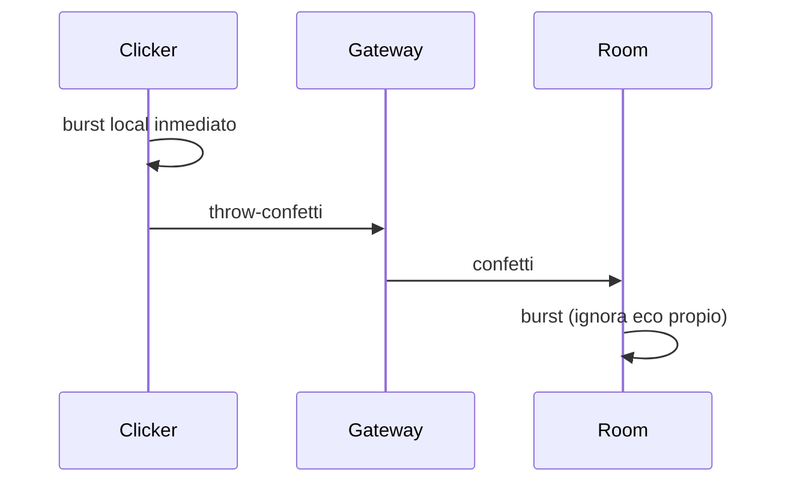

# Confeti sincronizado en el tablero

Cualquier persona en la retro (facilitator, miembro o invitado) ve un botón 🎉 en el header con tooltip **Lanzar confeti**. Al hacer clic, el efecto sale en **todas** las pantallas de esa sala. No se guarda en DB: es efímero, como el timer en vivo.

## Backend — relay por socket

Hoy el gateway solo hace `join-retro` ([`backend/src/retros/retro.gateway.ts`](backend/src/retros/retro.gateway.ts)). Agregar `throw-confetti`:

- Body: `{ retroId: string }`
- Solo si el socket ya está en `retro:${retroId}` (mismo criterio que el resto: si estás en la página, estás en la room)
- Broadcast `confetti` a esa room (incluye al emisor; el cliente filtra el eco)
- **Cooldown ~1 s por socket** (Map en memoria) para que se pueda spamear un poco esperando, sin saturar
- Payload mínimo: `{ id: string }` (uuid corto) para deduplicar

Sin endpoint HTTP, sin Prisma, sin tocar [`retros.service.ts`](backend/src/retros/retros.service.ts).

## Frontend — botón + efecto

**Dependencia:** `canvas-confetti` (liviana, canvas a pantalla completa, no bloquea clics).

**Socket:** agregar `emit()` en [`frontend/src/app/core/socket.service.ts`](frontend/src/app/core/socket.service.ts) (hoy solo tiene `on` / `off` / `joinRetro`).

**UI** en [`retro.page.html`](frontend/src/app/pages/retro/retro.page.html) / [`retro.page.ts`](frontend/src/app/pages/retro/retro.page.ts):

- Botón en `.header-actions`, visible para todos (no solo facilitator), en cualquier fase de la retro
- `title="Lanzar confeti"` + `aria-label`
- Estilo `btn-ghost btn-sm` para no competir con Invitar / Ajustes
- Click: dispara local + `sockets.emit('throw-confetti', { retroId })`
- Listener `confetti`: si el `id` no es el propio, dispara el mismo burst
- En `ngOnDestroy`, sacar el listener (igual que el resto)

**Burst:** 2–3 disparos cortos (estilo cañón), paleta Trinomio (`#008ACE`, `#7EC8E8`, `#E3F2FD` + un toque de dorado). Origen cerca del tope de la pantalla.

**Accesibilidad:** si `prefers-reduced-motion: reduce`, no animar; opcional un toast corto “🎉” reusando el patrón de [`copyToast`](frontend/src/app/pages/retro/retro.page.ts).

## Fuera de alcance

- Botón por tarjeta
- Sonido
- Persistencia / historial
- Confeti al avanzar de fase o al votar (solo disparo manual)
