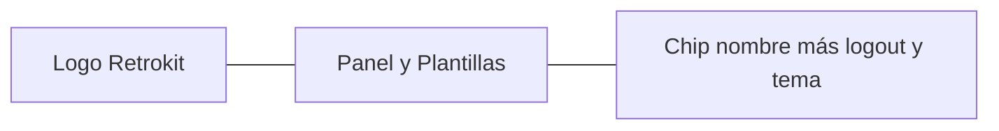

# Disposición del Panel, Equipo y topbar

Cambios solo de layout en el frontend. Sin rutas nuevas ni backend.

## 1. Equipo: Nueva retrospectiva en modal

En [`frontend/src/app/pages/team/team.page.ts`](frontend/src/app/pages/team/team.page.ts), el formulario grande deja de estar siempre en el flujo de la página.

- En el `page-header`, agrupar acciones: **Nueva retrospectiva** (`btn-primary`) al lado de **Tablero de acciones** (`btn-secondary`).
- El formulario actual se mueve a un overlay, reusando el patrón de [`image-crop-modal.component.ts`](frontend/src/app/shared/image-crop-modal.component.ts) (`--color-overlay`, click en backdrop cierra, `role="dialog"`).
- Cerrar: backdrop, Escape, y un **Cancelar**.
- Misma lógica de `createRetro()`: al éxito sigue yendo a `/retros/:id`. El error queda dentro del modal.
- El recordatorio de acciones pendientes sigue en la página del equipo (no dentro del modal).

El resto de la página (invitar, miembros, historial) queda como está.

## 2. Panel: crear / unirse al lado de Equipos

En [`frontend/src/app/pages/dashboard/dashboard.page.ts`](frontend/src/app/pages/dashboard/dashboard.page.ts):

- Quitar `grid-actions` del tope de la página.
- Cabecera de sección: `Equipos` + botón (icono `+` + **Nuevo**), `aria-expanded`.
- Al click, se expanden los dos formularios existentes (Crear equipo / Unirse con código) **debajo del título**, encima de la grilla de equipos.
- Si no hay equipos, abrir el toggle por defecto para no esconder el onboarding.

## 3. Topbar: nav centrada + chip de perfil

En [`frontend/src/app/app.ts`](frontend/src/app/app.ts), pasar el header a 3 columnas (`1fr auto 1fr`):

- **Panel** y **Plantillas** al centro, con SVG inline (mismo estilo que el toggle de tema; sin librería nueva). Iconos: grilla para Panel, stack de documentos para Plantillas. `routerLinkActive` para marcar la ruta actual.
- En pantallas angostas, solo icono + `aria-label` para que no se rompa el centro.
- Nombre + logout en un chip (borde, radio píldora, fondo muted): nombre a la izquierda, botón icon-only de logout (SVG door/arrow) con `title` y `aria-label="Salir"`. El toggle de tema sigue afuera, a la derecha del chip.
- Invitado: el nombre entra en el mismo chip, sin logout.

## 4. Misma altura: Retros recientes y Acciones pendientes

El `.split` ya estira las `<section>`, pero `.card.list` solo crece con el contenido. Por eso, con una retro y cero acciones, la tarjeta vacía queda más baja (como en el screenshot).

En el mismo dashboard:

- `.split .section` en columna flex.
- `.card.list` con `flex: 1` para ocupar toda la columna.
- Empty state compacto centrado y estirado, para que el vacío visual coincida con la otra tarjeta.

En mobile (`max-width: 800px`) las columnas siguen apiladas; no hace falta igualar alturas.

## Archivos

- [`frontend/src/app/pages/team/team.page.ts`](frontend/src/app/pages/team/team.page.ts)
- [`frontend/src/app/pages/dashboard/dashboard.page.ts`](frontend/src/app/pages/dashboard/dashboard.page.ts)
- [`frontend/src/app/app.ts`](frontend/src/app/app.ts)

## Verificación

En el browser: abrir/cerrar el modal de nueva retro (backdrop, Escape, Cancelar y crear); toggle Nuevo en Panel (vacío y con equipos); nav centrada en desktop y compacta en viewport chico; chip de logout; las dos columnas del Panel con 0 y con 1 ítem.