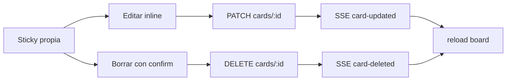

# Editar y borrar comentarios de la retrospectiva

Los “comentarios” son **cards**. El backend ya cubre el flujo:

- `PATCH /retros/:id/cards/:cardId` — solo el autor, fases `comments` o `grouping` ([`updateCard`](backend/src/retros/retros.service.ts))
- `DELETE /retros/:id/cards/:cardId` — autor o facilitador del equipo ([`deleteCard`](backend/src/retros/retros.service.ts))

En el frontend falta el UI: [`deleteCard`](frontend/src/app/core/api.service.ts) existe pero no se usa, y no hay `updateCard`.

## Alcance

- **Quién:** el autor de la card (`card.authorId === retro.me.participantId`).
- **Cuándo:** fases `comments` y `grouping`.
- **Qué cards:** individuales, no ocultas y **sin grupo**. Las agrupadas se muestran como un sticky concatenado (`cardsForColumn`); editar/borrar ahí solo tocaría la primera card.
- **Facilitador borrando cards ajenas:** el API ya lo permite; **no se muestra en el UI** en este cambio (el tablero trata a cualquier usuario logueado como “facilitador”, que no coincide con el rol real del equipo).

## Cambios

### 1. API client — [`frontend/src/app/core/api.service.ts`](frontend/src/app/core/api.service.ts)

Agregar `updateCard(id, cardId, body)` → `PATCH /retros/:id/cards/:cardId` con `{ content, isAnonymous? }`. Reutilizar `deleteCard`.

### 2. Tablero — [`retro.page.ts`](frontend/src/app/pages/retro/retro.page.ts) / [`.html`](frontend/src/app/pages/retro/retro.page.html) / [`.scss`](frontend/src/app/pages/retro/retro.page.scss)

- Escuchar `card-updated` en el socket (hoy no se recarga al editar).
- Estado de edición: `editingCardId` + `editDraft` (+ checkbox anónimo si `allowAnonymous`).
- Helpers: `isOwnCard(card)`, `canManageCard(card)` (fase + autor + `!hidden` + sin `groupId` / `isGroup`).
- En cada sticky propia, fila de acciones al estilo `.vote-row`:
  - **Editar** (`btn-ghost btn-sm`): reemplaza el `
` por textarea + Guardar / Cancelar (mismo patrón que el composer).
  - **Borrar** (`btn-danger btn-sm`): `confirm()` y luego `deleteCard`, igual que “Borrar retro”.
- `$event.stopPropagation()` para no disparar el agrupado.
- Tras guardar/borrar: `reload()`. Si el usuario estaba en el límite, `canComment()` ya vuelve a habilitar el composer.

## Fuera de alcance

- Mover de columna al editar.
- Editar/borrar cards agrupadas o en fases posteriores (`voting` / `actions`).
- Botón de borrar para el facilitador sobre cards de otros.
- Tests automatizados (el repo no tiene specs de frontend/backend para retros).

## Verificación

Probar en el browser en `comments` y `grouping`: editar y borrar una card propia, anónima si aplica, cancelar edición, y que el límite se libere al borrar. Confirmar que cards ajenas/ocultas/agrupadas no muestran acciones.