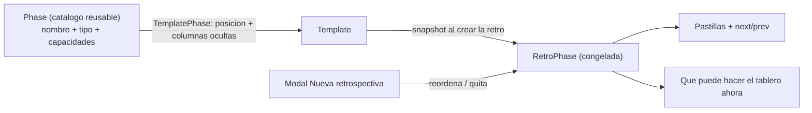

# Fases personalizables, ABM de fases y Semáforo

## La idea en una frase

Hoy una fase es un valor de enum con comportamiento hardcodeado. Va a pasar a ser **un registro con capacidades**: Comentarios, Agrupar y Votar dejan de ser código especial y quedan como *presets* del mismo motor de "fase de tablero", que es el mismo motor con el que se arman las fases custom.



Esto implica migrar `Retrospective.status` (enum) a `currentPhaseId` (FK al snapshot). Son ~45 referencias a `status` en [frontend/src/app/pages/retro/retro.page.ts](frontend/src/app/pages/retro/retro.page.ts) y su HTML, y 33 en [backend/src/retros/retros.service.ts](backend/src/retros/retros.service.ts). Se hace una sola vez, acá.

## Estado actual relevante

- `PHASE_ORDER` en [backend/src/retros/retros.service.ts](backend/src/retros/retros.service.ts) (línea 38) y `PHASES` / `PHASE_LABELS` en [frontend/src/app/core/models/index.ts](frontend/src/app/core/models/index.ts) (línea 379).
- El tablero decide todo por `@if (r.status === 'comments' || r.status === 'grouping')` en [frontend/src/app/pages/retro/retro.page.html](frontend/src/app/pages/retro/retro.page.html) (líneas 345, 1016, 1193).
- Ya existe lo que vamos a generalizar: ocultar tarjetas ajenas (`hideOthers`, `retros.service.ts` línea 1315), anónimo (`allowAnonymous` a nivel retro), modo presentación (`presenterCardId`, sólo en `actions`), orden por votos (`sortMode` en la fase de acciones), timer (`timerSeconds`) y el checkbox "Estoy listo" (`commentsReady` / `votesReady`).
- La plantilla ya hace snapshot de columnas en la retro (`columns: { create: template.columns.map(...) }`, línea 135): las fases siguen ese patrón.
- `@angular/cdk/drag-drop` ya está instalado y en uso en [frontend/src/app/pages/actions/actions.page.ts](frontend/src/app/pages/actions/actions.page.ts).
- Reacciones con emoji no existen todavía (hay que crearlas), pero `app-emoji-picker` ya está.
- El nav de [frontend/src/app/shared/app-nav-rail.component.ts](frontend/src/app/shared/app-nav-rail.component.ts) es plano: hay que agregarle un grupo desplegable para "Plantillas > Listado / Fases".

## Decisiones tomadas

- Catálogo de fases propio y reusable, con ABM en "Plantillas > Fases", con alcance global (admin) y personal, igual que las plantillas.
- Motor unificado ahora: una sola migración, un solo refactor.
- Orden libre de fases; cada fase aparece a lo sumo una vez por plantilla/retro; mínimo una.
- Semáforo = health check de ítems configurables, con voto visible por persona.
- Todas las capacidades propuestas entran, con reglas de invalidación centralizadas.

---

## Modelo de datos

Migración nueva en `backend/prisma/migrations/2026xxxx_phase_engine/`.

```prisma
enum PhaseKind {
  board             // tablero de tarjetas (Comentarios, Agrupar, Votar y las custom)
  action_plan       // plan de acción (vista fija)
  roti              // vista fija
  semaforo          // vista fija
  semaforo_review   // vista fija
}

enum CardContentMode  { text_and_image  image_only  text_only }
enum OthersVisibility { visible  blurred  hidden }
enum VotingMode       { off  single  multi }
enum CardSort         { original  most_voted  least_voted  random }
enum SemaforoValue    { red  yellow  green }

model Phase {
  id            String    @id @default(cuid())
  name          String
  description   String?
  kind          PhaseKind @default(board)
  icon          String?                       // emoji de la pastilla
  color         String?                       // hex de la pastilla
  instructions  String?                       // consigna visible para el equipo
  timerSeconds  Int?
  isGlobal      Boolean   @default(false)
  isSystem      Boolean   @default(false)     // presets: no se editan ni borran, se duplican
  createdById   String?

  // capacidades (sólo aplican con kind = board)
  allowCreateCards         Boolean          @default(true)
  cardContent              CardContentMode  @default(text_and_image)
  maxCardsPerParticipant   Int?                              // null = usar el de la retro
  allowEditOwnCards        Boolean          @default(true)
  anonymousCards           Boolean          @default(false)  // todas anónimas menos las propias
  othersVisibility         OthersVisibility @default(visible)
  revealOnReady            Boolean          @default(false)
  allowGrouping            Boolean          @default(false)
  allowCrossColumnGrouping Boolean          @default(false)
  voting                   VotingMode       @default(off)
  hideVoteCounts           Boolean          @default(false)
  allowReactions           Boolean          @default(false)
  reactionEmojis           String[]         @default(["👍","❤️","🎉","😮","😕"])
  allowPresentation        Boolean          @default(false)
  allowActionItems         Boolean          @default(false)
  showReadyCheck           Boolean          @default(true)
  defaultSort              CardSort         @default(original)

  templates     TemplatePhase[]
}

model TemplatePhase {
  id             String   @id @default(cuid())
  templateId     String
  phaseId        String
  position       Int
  hiddenColumns  TemplatePhaseHiddenColumn[]
  @@unique([templateId, phaseId])
}

model TemplatePhaseHiddenColumn {   // join: FK con cascade limpia solo al borrar columnas
  templatePhaseId String
  columnId        String
  @@id([templatePhaseId, columnId])
}

model RetroPhase {                  // snapshot plano de Phase (misma lista de campos)
  id            String @id @default(cuid())
  retroId       String
  position      Int
  sourcePhaseId String?             // sólo informativo
  // name, kind, icon, color, instructions, timerSeconds + todas las capacidades
  hiddenColumns RetroPhaseHiddenColumn[]
  cards         Card[]              // tarjetas creadas durante esta fase
}

model RetroPhaseHiddenColumn { retroPhaseId String  columnId String  @@id([retroPhaseId, columnId]) }

model CardReaction {
  id            String @id @default(cuid())
  retroId       String
  cardId        String
  participantId String
  emoji         String
  @@unique([cardId, participantId, emoji])
}

model TemplateSemaforoItem { id, templateId, title, description?, position }
model RetroSemaforoItem    { id, retroId, title, description?, position, note? }
model SemaforoVote {
  id, retroId, itemId, participantId
  value SemaforoValue
  @@unique([itemId, participantId])
}
```

Cambios sobre modelos existentes:

- `Retrospective`: se agrega `currentPhaseId String?` + `phases RetroPhase[]` y **se borra** `status` (y el enum `RetroStatus`). "Cerrada" pasa a ser `closedAt != null`, que ya existe.
- `Card`: se agrega `createdInPhaseId String?` (permite el límite de tarjetas *por fase* y saber en qué fase salió cada idea).
- `Template`: se agrega `phases TemplatePhase[]` + `semaforoItems TemplateSemaforoItem[]`.
- `Participant`: se agrega `semaforoReady Boolean @default(false)` (junto a los `commentsReady` / `votesReady` que ya están).

`hiddenColumns` como tabla join en vez de `String[]` para que el borrado de una columna limpie solo las referencias por FK.

### Presets del sistema (seed, `isSystem = true`, `isGlobal = true`)

- **Comentarios** — board: `allowCreateCards`, `text_and_image`, `othersVisibility = hidden`, `showReadyCheck`. Reproduce el `hideOthers` de hoy (el facilitator sigue viendo todo).
- **Agrupar** — board: `allowCreateCards`, `allowGrouping`, `othersVisibility = visible`, `showReadyCheck`.
- **Votar** — board: `allowCreateCards = false`, `voting = multi`, `showReadyCheck`.
- **Plan de acción** — `action_plan`: `allowPresentation`, `allowActionItems`, `defaultSort = most_voted`.
- **ROTI** — `roti`.
- **Semáforo** — `semaforo`.
- **Analizar semáforo** — `semaforo_review`: `allowActionItems`.

Los presets no se editan: el botón es "Duplicar", y la copia queda personal y editable.

---

## Reglas de invalidación

Se implementan una sola vez en `normalizePhase(config)` y `phaseCapabilities(phase)`, en `backend/src/retros/phase-rules.ts`, con un gemelo en `frontend/src/app/core/phase-rules.ts` (el repo no tiene paquete compartido; van ~90 líneas duplicadas con un comentario cruzado en cada archivo). El backend normaliza al guardar, el frontend usa lo mismo para deshabilitar controles y mostrar el por qué.

Reglas duras:

- `kind != board`: se ignoran todas las capacidades de tablero. El editor sólo muestra nombre, ícono, color, consigna y timer.
- `allowCreateCards = false`: deshabilita y resetea `cardContent`, `maxCardsPerParticipant` y `allowEditOwnCards`.
- `othersVisibility != visible` (borrosas u ocultas): deshabilita `anonymousCards`, porque el blur ya tapa autor y contenido. Es el caso que planteaste.
- `othersVisibility != visible` **y** `revealOnReady = false`: apaga y deshabilita `allowGrouping`, `voting`, `allowReactions`, `allowPresentation` y fija `defaultSort = original`. No se puede operar sobre lo que nunca se ve.
- `revealOnReady = true`: fuerza `showReadyCheck = true` (sin checkbox no hay forma de revelar) y sólo tiene sentido si `othersVisibility != visible`.
- `voting != off` y `allowReactions = true` son excluyentes: activar uno apaga el otro, con aviso. Las reacciones reemplazan a los votos, como pediste.
- `voting = single`: fija `maxVotesPerCard = 1` en la plantilla y en el modal de creación, con el input deshabilitado y un hint; en el tablero el `−  1/2  +` se reemplaza por un botón de like que togglea. `votesPerParticipant` sigue valiendo como "a cuántas tarjetas puede darle like" (vacío = ilimitado).
- `voting = off` y `allowReactions = false`: `defaultSort` sólo puede ser `original` o `random`, y `hideVoteCounts` queda deshabilitado.
- `allowGrouping = false`: deshabilita `allowCrossColumnGrouping`.
- `allowReactions = true`: `reactionEmojis` necesita al menos un emoji.
- Columnas por fase: al menos una visible.
- Plantilla/retro: al menos una fase; cada fase a lo sumo una vez.

Avisos suaves (no bloquean, se muestran como hint en el editor de plantillas):

- Una fase con votación sin ninguna fase con agrupación antes.
- `semaforo_review` sin `semaforo` antes.
- Una fase con `allowActionItems` y ninguna fase con votos ni reacciones.
- Dos fases con votación en la misma retro: los `Vote` son por retro, no por fase, así que los votos se arrastran de una a la otra.

---

## Mockups

### 1. Nav: Plantillas desplegable

```
 ⌂ Panel
 ▦ Retros
 ✓ Acciones
 ⋯
 ⊞ Plantillas                          ⌄
   │  Listado
   │  Fases
 ⚙ Usuarios
```

### 2. Listado de fases (el ABM)

```
 Fases                                                 [ + Nueva fase ]
 Las fases del sistema no se editan: duplicalas para personalizarlas.

 ┌──────────────────────────────────────────────────────────────────────┐
 │ 💬 Comentarios                                 Sistema · Tablero    │
 │    Escribir sin ver lo que ponen los demás                          │
 │    escribir · oculta a otros · listo               [Duplicar] [Ver] │
 ├──────────────────────────────────────────────────────────────────────┤
 │ 🗂 Agrupar                                      Sistema · Tablero    │
 │    escribir · agrupar · listo                      [Duplicar] [Ver] │
 ├──────────────────────────────────────────────────────────────────────┤
 │ 🔥 Brainwriting privado                         Personal · Tablero  │
 │    escribir · borrosas · revela al marcar listo                     │
 │    Usada en 2 plantillas         [Duplicar] [Editar] [Eliminar]     │
 ├──────────────────────────────────────────────────────────────────────┤
 │ 😀 Reacciones rápidas                            Global · Tablero   │
 │    reacciones 👍❤️🎉 · sin votos · sólo lectura                      │
 │    Usada en 1 plantilla          [Duplicar] [Editar] [Eliminar]     │
 └──────────────────────────────────────────────────────────────────────┘
```

Eliminar una fase en uso avisa en qué plantillas está y ofrece quitarla de todas o cancelar. Las retros ya creadas nunca se tocan (tienen su snapshot).

### 3. Editor de fase

```
 ┌─ Editar fase ────────────────────────────────────────── [ Volver ] ──┐
 │ Nombre  [ Brainwriting privado      ]  Ícono [🔥]  Color [#f97316]   │
 │ Tipo    (•) Tablero de tarjetas  ( ) Plan de acción  ( ) ROTI        │
 │         ( ) Semáforo  ( ) Analizar semáforo                          │
 │ Consigna [ Escribí sin mirar lo que ponen los demás.             ]   │
 │ Timer    [ 5 min ▾ ]              Alcance (•) Personal ( ) Global    │
 │                                                                      │
 │ ── Escritura ─────────────────────────────────────────────────────    │
 │ [x] Permitir crear tarjetas                                          │
 │     Contenido  (•) Texto e imagen  ( ) Sólo imagen  ( ) Sólo texto   │
 │     Máx. por persona en esta fase [ 3 ]   (vacío = el de la retro)   │
 │ [x] Permitir editar y borrar las tarjetas propias                    │
 │                                                                      │
 │ ── Visibilidad ───────────────────────────────────────────────────    │
 │ Tarjetas de otros  ( ) Visibles  (•) Borrosas  ( ) Ocultas           │
 │ [x] Revelar las de cada persona cuando marca "listo"                 │
 │ [ ] Mostrar todas como anónimas (menos las propias)          ⊘       │
 │     ⓘ Sin efecto: con las tarjetas borrosas ya no se ve el autor     │
 │                                                                      │
 │ ── Interacción ───────────────────────────────────────────────────    │
 │ [ ] Permitir agrupar tarjetas                                        │
 │     [ ] Agrupar entre columnas distintas                     ⊘       │
 │ Votación  (•) Sin votos  ( ) Un voto (like)  ( ) Múltiple (−/+)      │
 │     ⓘ "Un voto" fija en 1 el máx. de votos por comentario            │
 │ [ ] Ocultar el conteo hasta cambiar de fase                  ⊘       │
 │ [x] Reacciones con emoji    👍 ❤️ 🎉 😮 😕   [ + ]                    │
 │     ⓘ Las reacciones reemplazan la votación: se apagó "Votación"     │
 │ [ ] Modo presentación de tarjetas                                    │
 │ [ ] Permitir crear accionables desde las tarjetas                    │
 │                                                                      │
 │ ── Facilitación ──────────────────────────────────────────────────    │
 │ [x] Checkbox "Estoy listo" y panel de progreso        (forzado)      │
 │ Orden  (•) Original  ( ) Más votadas  ( ) Menos votadas  ( ) Azar    │
 │                                                                      │
 │ ── Vista previa ──────────────────────────────────────────────────    │
 │  Pastilla   ╭────────────────────────╮                               │
 │             │ 🔥 Brainwriting privado│                               │
 │             ╰────────────────────────╯                               │
 │  Tablero    ┌──────────┐ ┌──────────┐ ┌──────────┐                   │
 │             │ ▒▒▒▒ ▒▒▒ │ │ tu       │ │ ▒▒▒▒▒▒   │                   │
 │             │ (borrosa)│ │ tarjeta  │ │ (borrosa)│                   │
 │             └──────────┘ └──────────┘ └──────────┘                   │
 │             [ textarea · 😀 · Imagen/GIF · Añadir ]                  │
 │                                                     [ Guardar fase ] │
 └──────────────────────────────────────────────────────────────────────┘
      ⊘ = deshabilitado por otra opción, con el motivo debajo
```

### 4. Editor de plantillas: sección Fases

Va entre "Fondo del tablero" y "Columnas" en [frontend/src/app/pages/templates/template-editor.page.ts](frontend/src/app/pages/templates/template-editor.page.ts).

```
 Fases
 Arrastrá para reordenar, × para quitar, clic para configurar la fase acá.

 ╭──────────────╮ ╭────────────╮ ╭═══════════════════════╮ ╭──────────╮
 │ ⠿ Comentarios│ │ ⠿ Agrupar ×│ ║ ⠿ 🔥 Brainwriting pr.×║ │ ⠿ Votar ×│
 ╰──────────────╯ ╰────────────╯ ╰═══ seleccionada ══════╯ ╰──────────╯

 Agregar fase:  [ + Plan de acción ] [ + ROTI ] [ + Semáforo ]
                [ + Analizar semáforo ] [ + 😀 Reacciones rápidas ]
                [ Crear una fase nueva ↗ ]

 ┌─ 🔥 Brainwriting privado · en esta plantilla ───────────────────────┐
 │ Columnas visibles en esta fase                                     │
 │  [x] ▶ Qué salió bien   [x] ■ Qué mejorar   [ ] ↻ Ideas locas      │
 │      (tiene que quedar al menos una)                               │
 │                                                                    │
 │ Capacidades: escribir · borrosas · revela al marcar listo · listo  │
 │ Se configuran en la fase, no acá.             [ Editar la fase ↗ ] │
 └────────────────────────────────────────────────────────────────────┘
   ⓘ Pusiste "Votar" sin ninguna fase de agrupación antes: se puede,
     pero se vota tarjeta por tarjeta.
```

### 5. Ítems del semáforo (en la plantilla)

Aparece sólo si alguna fase es Semáforo o Analizar semáforo.

```
 Ítems del semáforo                                    [ Agregar ítem ]
 Diseño fijo: la retro muestra siempre la misma grilla, no las columnas.

 ┌────────────────────────────────────────────────────────────────────┐
 │ ⠿  Título [ Comunicación     ]  Detalle [ ¿Nos enteramos a tiempo?]│
 │                                                          [ Quitar ]│
 ├────────────────────────────────────────────────────────────────────┤
 │ ⠿  Título [ Calidad          ]  Detalle [ ¿Estamos conformes?     ]│
 │                                                          [ Quitar ]│
 └────────────────────────────────────────────────────────────────────┘
   Máx. 8 ítems.
```

### 6. Modal Nueva retrospectiva

```
 ┌─ Nueva retrospectiva ───────────────────────────────────────────────┐
 │ Título    [ Sprint 42                                            ] │
 │ Plantilla [ Start / Stop / Continue                            ▾ ] │
 │                                                                     │
 │ Fases                                    [ Restaurar de plantilla ] │
 │ ╭──────────────╮ ╭────────────╮ ╭──────────╮ ╭────────────────────╮ │
 │ │ ⠿ Comentarios│ │ ⠿ Agrupar ×│ │ ⠿ Votar ×│ │ ⠿ Plan de acción  ×│ │
 │ ╰──────────────╯ ╰────────────╯ ╰──────────╯ ╰────────────────────╯ │
 │ Agregar fase: [ + Semáforo ] [ + Analizar semáforo ] [ + ROTI ]     │
 │                                                                     │
 │ ▸ Ítems del semáforo (4)         ← se despliega si Semáforo está    │
 │                                                                     │
 │ Máx. comentarios [ 3 ]  Votos [ 5 ]  Máx x comentario [ 1 ] ⊘       │
 │   ⓘ La fase "Like único" permite un solo voto por comentario        │
 │ Timer [ 5 min ▾ ]                                                   │
 │                                        [ Cancelar ] [ Crear retro ] │
 └─────────────────────────────────────────────────────────────────────┘
```

Cambiar de plantilla resetea fases e ítems (igual que hace hoy `applyDefaults`). Las columnas ocultas por fase vienen de la plantilla y no se editan acá.

### 7. Tablero: like único y reacciones

```
 ┌───────────────────────────┐   ┌───────────────────────────┐
 │ Nos falta documentar el   │   │ El deploy tardó 40 min    │
 │ onboarding                │   │                           │
 │ (A) Ana                   │   │ Anónimo                   │
 │ ─────────────────────────  │   │ ─────────────────────────  │
 │  [ ♥ Me gusta · 4 ]       │   │  👍 3   ❤️ 1   🎉 —   [ + ]│
 │    ^ voting = single      │   │    ^ allowReactions        │
 └───────────────────────────┘   └───────────────────────────┘
      reemplaza al  [−] 1/2 [+]  de voting = multi
```

Con `hideVoteCounts` el número se muestra como `·` hasta que la fase cambie.

### 8. Fase Semáforo (diseño fijo, no usa las columnas)

```
  Comentarios   [ Semáforo ]   Analizar semáforo   Agrupar   Votar
 ─────────────────────────────────────────────────────────────────────────
  Pintá cada ítem según cómo lo ves.   Listos: 3/5   [x] Estoy listo
 ┌──────────────────────┬────────┬─────┬──────┬──────┬──────┬───────────┐
 │ Ítem                 │ Vos    │ (A) │ (B)  │ (C)  │ (D)  │ Resumen   │
 │                      │        │ Ana │ Beto │ Caro │ Dani │           │
 ├──────────────────────┼────────┼─────┼──────┼──────┼──────┼───────────┤
 │ Comunicación         │ 🔴🟡[🟢]│ 🟢  │  🟡  │  ·   │  🟢  │ ▇▇▇▁▁ 3/1/0│
 │ ¿Nos enteramos a...  │        │     │      │      │      │           │
 ├──────────────────────┼────────┼─────┼──────┼──────┼──────┼───────────┤
 │ Calidad              │ [🔴]🟡🟢│ 🔴  │  🔴  │  🟡  │  ·   │ ▇▁▁▁▁ 0/1/3│
 │ ¿Estamos conformes?  │        │     │      │      │      │           │
 ├──────────────────────┼────────┼─────┼──────┼──────┼──────┼───────────┤
 │ Carga de trabajo     │ 🔴🟡🟢 │ 🟡  │  🟢  │  🟢  │  🟡  │ ▇▇▇▇▁ 2/2/0│
 └──────────────────────┴────────┴─────┴──────┴──────┴──────┴───────────┘
   ·  = todavía no votó        [🟢] = tu voto
```

Los avatares de las columnas son `app-user-avatar`, el mismo que usa `.progress-people`. En mobile colapsa a una tarjeta por ítem. "Estoy listo" reusa el patrón de `toggleCommentsReady` con `semaforoReady`.

### 9. Fase Analizar semáforo

```
  Comentarios   Semáforo   [ Analizar semáforo ]   Agrupar   Votar
 ─────────────────────────────────────────────────────────────────────────
  Ordenado por peor resultado                        Promedio equipo: 🟡
 ┌───────────────────────────────────────────────────────────────────────┐
 │ ▾ Calidad                                        ▇▇▇▇▁  0/1/3   ⚠️    │
 │   ¿Estamos conformes con lo que entregamos?                           │
 │   🔴 Ana · Beto · Dani      🟡 Caro      🟢 —      sin votar: —       │
 │   ┌─────────────────────────────────────────────────────────────────┐ │
 │   │ Nota del equipo: la deuda técnica del checkout nos frena…       │ │
 │   └─────────────────────────────────────────────────────────────────┘ │
 │                                          [ + Crear accionable ]       │
 ├───────────────────────────────────────────────────────────────────────┤
 │ ▸ Carga de trabajo                               ▇▇▇▇▁  2/2/0         │
 │ ▸ Comunicación                                   ▇▇▇▇▇  3/1/0   ✅    │
 └───────────────────────────────────────────────────────────────────────┘
```

Primer ítem abierto, el resto colapsado, orden por cantidad de rojos. La nota la edita el facilitator y se propaga por socket. "Crear accionable" abre el `app-action-item-modal` que ya existe, con el título precargado.

---

## Cambios por archivo

### Backend

- **Prisma + migración**: todo el modelo de arriba, más el script de datos (ver abajo).
- **`backend/src/retros/phase-rules.ts`** (nuevo): `normalizePhase()`, `phaseCapabilities()`, `resolveMaxCards()`. Única fuente de las reglas.
- **`backend/src/phases/`** (nuevo módulo): `GET /phases` (globales + propias), `POST`, `PATCH`, `DELETE` (bloquea si `isSystem`, avisa uso en plantillas), `POST /phases/:id/duplicate`. Permisos con el mismo patrón global/personal que templates (`isGlobal` + `createdById`, `isAdmin` para las globales), ver la migración `20260915210000_template_personal_scope`.
- **[backend/src/retros/retros.service.ts](backend/src/retros/retros.service.ts)**: el trabajo grueso.
  - Borrar `PHASE_ORDER`; `advancePhase(user, retroId, phaseId | 'closed')` valida que la fase pertenezca a la retro.
  - `create()`: snapshot de `TemplatePhase` a `RetroPhase` (con columnas ocultas remapeadas a los ids de `RetroColumn` recién creados), `currentPhaseId` = primera fase, snapshot de `semaforoItems`.
  - Reemplazar los 33 `retro.status === X` por capacidades: `phase.allowCreateCards` en create/update/delete de cards, `phase.allowGrouping` en group/ungroup, `phase.voting !== 'off'` en `setVote` (con `count <= 1` si es `single`), `phase.allowPresentation` en `setPresenter`, `phase.allowActionItems` en `createActionFromRetro`, `phase.kind === 'roti'` en `submitRoti`.
  - `getBoard()`: generalizar `hideOthers` a `othersVisibility` + `revealOnReady` (el facilitator sigue viendo todo), marcar `blurred` en el DTO en lugar de sólo `hidden`, forzar `authorName = 'Anonymous'` cuando `anonymousCards` y la tarjeta no es propia, filtrar columnas ocultas, ordenar según `defaultSort`, ocultar conteos con `hideVoteCounts`, exponer `phases`, `currentPhaseId`, `closed` y `semaforoProgress`.
  - `setReady()`: ramas por capacidad en vez de por status, más `semaforoReady`.
  - Nuevos: `toggleReaction()`, `setSemaforoVote()`, `setSemaforoNote()`; eventos `card-reaction`, `semaforo-vote`, `semaforo-note`.
- **[backend/src/retros/retros.controller.ts](backend/src/retros/retros.controller.ts)** y **[backend/src/retros/dto/retros.dto.ts](backend/src/retros/dto/retros.dto.ts)**: `POST :id/phase` pasa a recibir `phaseId`; nuevos endpoints de reacciones y semáforo; `CreateRetroDto` con `phases: { phaseId, position }[]`.
- **`backend/src/templates/`**: `phases` (con posición y columnas ocultas) y `semaforoItems` en create/update, con el mismo reemplazo transaccional que hoy usa para `columns`.

### Frontend

- **[frontend/src/app/core/models/index.ts](frontend/src/app/core/models/index.ts)**: `Phase`, `PhaseKind`, `RetroPhase`, `CardReaction`, `SemaforoItem`, tipos de capacidades. `RetroBoard` cambia `status` por `phases: RetroPhase[]`, `currentPhaseId` y `closed`. Se borran `PHASES` y `PHASE_LABELS`; `RetroSummary` pasa a llevar `currentPhaseName`.
- **`frontend/src/app/core/phase-rules.ts`** (nuevo): gemelo del backend.
- **`frontend/src/app/shared/phase-pills.component.ts`** (nuevo): `[phases]`, `[activeId]`, `[mode]="'retro' | 'edit'"`, `(phasesChange)`, `(select)`. En `edit` usa `cdkDropList` horizontal, `×` y la fila "Agregar fase". El `<nav class="phases">` de la retro pasa a usarlo, así la vista previa es literalmente el mismo componente. Los estilos `.phases` / `.phase` se mueven de `retro.page.scss` al componente.
- **`frontend/src/app/pages/phases/phases.page.ts`** y **`phase-editor.page.ts`** (nuevos), rutas `/phases` y `/phases/:id`.
- **[frontend/src/app/shared/app-nav-rail.component.ts](frontend/src/app/shared/app-nav-rail.component.ts)**: grupo desplegable "Plantillas" con "Listado" y "Fases".
- **[frontend/src/app/pages/templates/template-editor.page.ts](frontend/src/app/pages/templates/template-editor.page.ts)**: secciones Fases (pastillas + panel de la fase seleccionada con columnas visibles) e Ítems del semáforo.
- **[frontend/src/app/pages/team/team.page.ts](frontend/src/app/pages/team/team.page.ts)**: pastillas en el modal, ítems del semáforo colapsables, regla de máx. votos con fase `single`.
- **[frontend/src/app/pages/retro/retro.page.ts](frontend/src/app/pages/retro/retro.page.ts) / `.html` / `.scss`**: `currentPhase()` computado; `nextPhase`/`prevPhase`/`isPhaseDone` sobre `r.phases`; todos los `@if (r.status === …)` pasan a capacidades; composer según `cardContent`; clase `.blurred` para tarjetas tapadas; like único; barra de reacciones; consigna de la fase arriba del tablero; timer que arranca con `phase.timerSeconds`; columnas filtradas; vistas de Semáforo y Analizar semáforo al mismo nivel que el bloque de ROTI (línea 1077).
- **[frontend/src/app/pages/dashboard/dashboard.page.ts](frontend/src/app/pages/dashboard/dashboard.page.ts)**, **[frontend/src/app/pages/actions/actions.page.ts](frontend/src/app/pages/actions/actions.page.ts)**, **[frontend/src/app/pages/report/report.page.ts](frontend/src/app/pages/report/report.page.ts)**: los ~13 usos de `status` para mostrar estado pasan a `closedAt` + `currentPhaseName`; el reporte suma el bloque del semáforo.
- **[frontend/src/app/core/api.service.ts](frontend/src/app/core/api.service.ts)**: CRUD de fases, `advancePhase(phaseId)`, `toggleReaction`, `setSemaforoVote`, `setSemaforoNote`.

## Migración de datos existentes

Todo en el `migration.sql`, en este orden:

1. Insertar los 7 presets del sistema en `Phase`.
2. Para cada `Template`, crear los `TemplatePhase` de los 5 clásicos (Comentarios, Agrupar, Votar, Plan de acción, ROTI) con posición 0..4 y sin columnas ocultas.
3. Para cada `Retrospective`, crear los 5 `RetroPhase` (snapshot de los presets) y setear `currentPhaseId` al que corresponda a su `status`; si estaba `closed`, `currentPhaseId` queda en la última y `closedAt` ya está seteado.
4. `Card.createdInPhaseId` queda en null para las tarjetas viejas (el límite por fase cae al valor de la retro).
5. Recién al final, borrar `Retrospective.status` y el enum `RetroStatus`.

Con esto, toda plantilla y retro existente queda exactamente como está hoy.

## Orden de implementación

1. Motor de fases: modelo, presets, snapshot y refactor de `status`. Sin UI nueva, todo tiene que seguir funcionando igual.
2. ABM del catálogo (listado + editor + nav).
3. Plantilla y modal de creación: pastillas, columnas por fase, ítems del semáforo.
4. Capacidades nuevas en el tablero: blur, anónimo, sólo imagen, like único, reacciones, presentación, orden, consigna, timer, límite por fase.
5. Semáforo y Analizar semáforo.
6. Reporte.

Los pasos 1 y 4 son los que tocan `retro.page.*`, así que conviene no mezclarlos con el resto.

## Ideas que dejo afuera por ahora

Las anoto acá por si querés sumarlas después: bloquear el tablero en sólo lectura mientras el facilitator presenta; una fase "sólo facilitator" en la que los participantes ven una pantalla de espera; ronda de timer por persona para hablar; importar y exportar fases como JSON; y que el semáforo compare contra las retros anteriores del equipo para ver tendencia.

## Verificación

Al terminar cada paso, `docker compose up -d --build web api` y avisar http://localhost:8090 (las migraciones corren en el entrypoint de `api`). Chequeos manuales clave: una retro vieja sigue con sus 5 fases y en la misma fase en la que estaba; una plantilla nueva con una fase custom de blur oculta bien las tarjetas ajenas y las revela al marcar "listo"; una fase con like único deja el máx. de votos en 1; una fase con reacciones no muestra los controles de voto.
