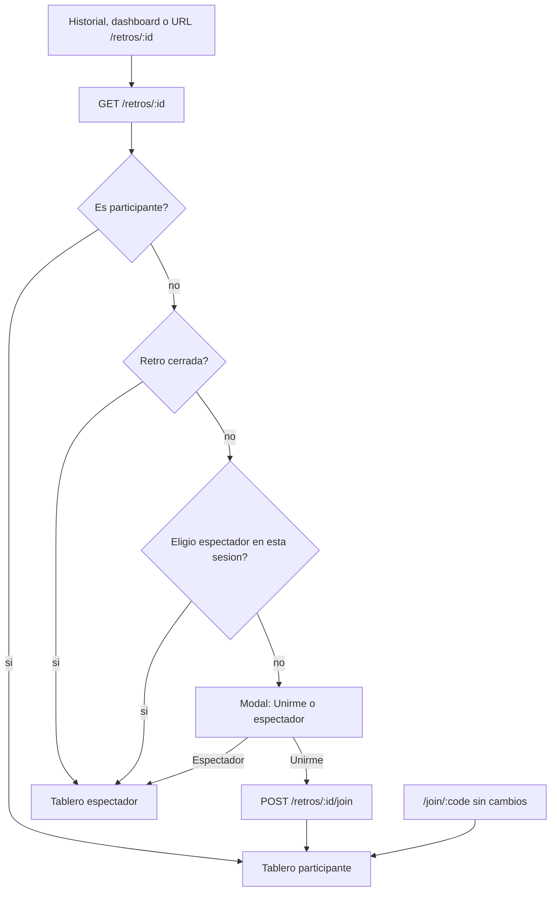

# Unirse o espectador desde el historial y `/retros/:id`

Hoy un miembro autenticado **ya puede** `GET /retros/:id` sin fila de `Participant` ([`loadAccess`](backend/src/retros/retros.service.ts)), pero no hay join por id (solo `POST /retros/join` con código) y el tablero no trata ese caso como modo espectador: se ven timer/ajustes (porque [`isFacilitator`](frontend/src/app/pages/retro/retro.page.ts) es `auth.isUser()`), el toggle “Estoy listo”, y en fase comentarios se ven **todas** las tarjetas sin ocultar.

Los links del historial ([`team.page.ts`](frontend/src/app/pages/team/team.page.ts)) y dashboard ([`dashboard.page.ts`](frontend/src/app/pages/dashboard/dashboard.page.ts)) siguen yendo a `/retros/:id`. Un solo modal en la página de retro cubre click y URL pegada.

`/join/:code` ([`join.page.ts`](frontend/src/app/pages/join/join.page.ts)) no cambia: invitados y miembros con código entran como participantes.

Quien no es del equipo y abre `/retros/:id` sigue con 403. El espectador es **solo miembro del equipo sin Participant**.

---

## 1. Backend: join por id y payload de acceso

En [`retros.controller.ts`](backend/src/retros/retros.controller.ts) / [`retros.service.ts`](backend/src/retros/retros.service.ts):

- `POST /retros/:id/join` (JWT de usuario). Reutiliza la lógica de join miembro: `assertMember` + find-or-create `Participant` + emit `participant-joined`. Sin código de invitación.
- Extraer el bloque de create-or-return participante de `join()` para no duplicar.
- En `getBoard.me` agregar `isFacilitator` (rol de equipo, ya existe `isFacilitator()` privado) para que el front deje de usar `auth.isUser()`.
- Anonimato en comentarios: `hideOthers` en fase `comments` para **cualquier** viewer del tablero vivo (no solo si hay Participant). El espectador ve `•••••` como el resto; el participante sigue viendo las suyas.

No hay modelo Prisma nuevo: espectador = miembro con acceso y `me.participantId` vacío.

---

## 2. Frontend: modal y modo espectador

En [`retro.page.ts`](frontend/src/app/pages/retro/retro.page.ts) / [`retro.page.html`](frontend/src/app/pages/retro/retro.page.html) / [`retro.page.scss`](frontend/src/app/pages/retro/retro.page.scss):

Tras el primer `getRetro` exitoso, si el usuario está logueado y **no** hay `me.participantId`:

- Retro `closed`: entrar directo como espectador (join no tiene sentido).
- Si no, overlay (no hay modales hoy; estilo card + backdrop, paleta Trinomio) con **Unirme a la retro** y **Entrar como espectador**.
- Espectador se guarda en `sessionStorage` (`retrokit:spectate:<id>`) para no repreguntar al recargar. Al unirse, se borra.

Computeds:

- `isParticipant` ← `!!me.participantId`
- `isSpectator` ← usuario + board cargado + no participante
- `isFacilitator` ← `me.isFacilitator && isParticipant` (facilitar implica haberse unido)

UI espectador — **ocultar**: timer (display y controles), Invitar, Ajustes, Borrar, “Siguiente fase”, fases clickeables, composer “Añadir”, mensaje de límite de comentarios (hoy sale mal porque `!canComment()`), “Estoy listo”, votos +/−, agrupar, editar/borrar tarjetas, form ROTI, form crear acción.

UI espectador — **mostrar**: título, fases como indicador, columnas/secciones y tarjetas, lista de acciones ya creadas (solo lectura), badge de votos en fase actions, y **miembros/participantes** (lista compacta; en comentarios/agrupar se puede reutilizar `commentProgress` sin el checkbox). Banner chico **Unirme a la retro** por si cambian de idea.

API: `joinRetroById(id)` en [`api.service.ts`](frontend/src/app/core/api.service.ts). Tipos en [`models/index.ts`](frontend/src/app/core/models/index.ts).

---

## 3. Verificación

Flujo real (browser o curl + UI):

- Miembro no participante: historial → modal → Unirme → composer/ready visibles; aparece en participantes.
- Mismo miembro: modal → espectador → sin timer/añadir/listo; tarjetas ocultas en comentarios; recarga no reabre el modal.
- Pegar `/retros/:id` logueado y del equipo, sin estar en la retro → mismo modal.
- `/join/:code` miembro e invitado siguen entrando como participantes, sin modal.
- Facilitador no unido no ve controles hasta Unirme.
- Usuario de otro equipo: 403.
