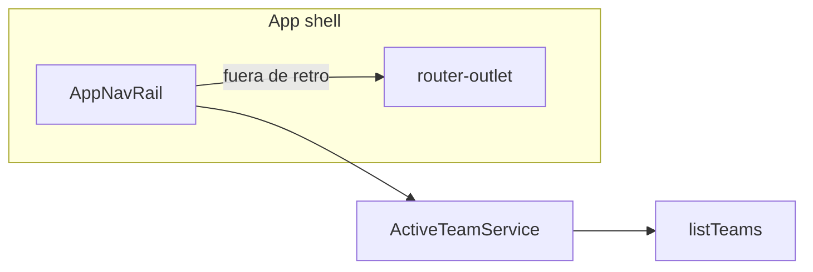

# Rail izquierda de producto (MVP)

## Decisiones cerradas

- Rail **solo fuera de la retro**: visible en Panel, Equipo, Acciones y Plantillas. **Oculta** en `/retros/*`, join, login/register (chrome de facilitación intacto). También **oculta** si el usuario aún no tiene equipos (onboarding en Panel).
- MVP = **shell + selector + links**. Evolucionó: Miembros = ruta `/teams/:id/members`; Equipos = `/teams`. Plantillas sigue global (`/templates`).
- Forma: **rail estrecha** (iconos + tooltip; expandible a labels). No secciones HOME/ACTIVITIES vacías ni items Neatro inexistentes.

## Enmiendas post-implementación

IA y flujos finales en [teams_admin_panel_ba233c0b.plan.md](teams_admin_panel_ba233c0b.plan.md) + [nav_polish_retros_a22b4c6d.plan.md](nav_polish_retros_a22b4c6d.plan.md).

## IA de la rail

```
Logo
[Selector de equipo]     ← lista completa via ApiService.listTeams()
─────────────────
Panel                    → /dashboard
Retros (hub)             → /teams/:activeId
Acciones                 → /teams/:activeId/actions
Miembros                 → /teams/:activeId#members
Plantillas*              → /templates (solo facilitador)
─────────────────
Tema · Avatar · Salir
```

`activeId`: si la URL es `/teams/:id` o `/teams/:id/actions`, ese equipo; si no, último equipo visitado (`localStorage`) o el primero de la lista. Items de equipo deshabilitados si no hay equipo.

Favoritos: el star sigue en hub/cards; en el dropdown del selector se pueden marcar/ver pins. **Salen de la topbar** (ya no son links sueltos).

## Arquitectura



### Archivos principales

- Nuevo [frontend/src/app/shared/app-nav-rail.component.ts](frontend/src/app/shared/app-nav-rail.component.ts) — rail + dropdown de equipos + expand/collapse.
- Nuevo [frontend/src/app/core/active-team.service.ts](frontend/src/app/core/active-team.service.ts) — `activeTeamId` desde ruta + persistencia; lista de equipos para el selector; al elegir equipo navega al hub.
- Reescribir shell en [frontend/src/app/app.ts](frontend/src/app/app.ts): layout `app-shell` con rail + `main`; **quitar** nav de topbar (Panel/Plantillas/favoritos). Cuenta/tema migran a la rail.
- [frontend/src/app/pages/team/team.page.ts](frontend/src/app/pages/team/team.page.ts): `id="members"` en la sección Miembros; scroll al fragmento al entrar; quitar del header el link **Tablero de acciones** (queda en la rail). Mantener **Nueva retrospectiva**, **Invitar**, **Borrar**.
- [frontend/src/app/pages/actions/actions.page.ts](frontend/src/app/pages/actions/actions.page.ts): quitar **Volver al equipo** (la rail cubre el hub).
- Estilos globales en [frontend/src/styles.scss](frontend/src/styles.scss): offset de `.page` para el ancho de la rail; variables `--nav-rail-width` / `--nav-rail-width-expanded`.
- [FavoriteTeamsService](frontend/src/app/core/favorite-teams.service.ts): se mantiene para stars; deja de alimentar la topbar.

### Visibilidad

En `app.ts`, mostrar rail solo si `auth.isUser()` **y** la URL no matchea `/retros`, `/join`, `/join-team`, `/login`, `/register`. Auth/guest pages sin rail.

### Selector de equipos

Popover anclado al botón del equipo activo (inicial + nombre si expandido):

- Lista de todos los equipos (`listTeams`).
- Click → `navigate(['/teams', id])` + set active.
- Pie: navegar al Panel (donde está **Nuevo** para crear/unirse).
- Star opcional en cada fila (reusa `setFavorite`); no limitar a 3 en el dropdown.

### Miembros ancla

- Sección hub: `id="members"`.
- Link rail: `routerLink` + `fragment: 'members'`.
- En `TeamPage`: si `ActivatedRoute.fragment === 'members'`, `scrollIntoView`.

### Fuera de alcance (MVP)

- Rutas nuevas (`/teams/:id/members`, settings, analytics).
- Cambiar chrome de retro / presencia.
- Org, billing, icebreakers.
- Sidebar ancha expandida por defecto.

## Verificación

Rebuild `web`. Probar: Panel → selector cambia de equipo → hub/acciones/miembros/plantillas; en `/retros/:id` no hay rail. URL: `http://localhost:8090`.
