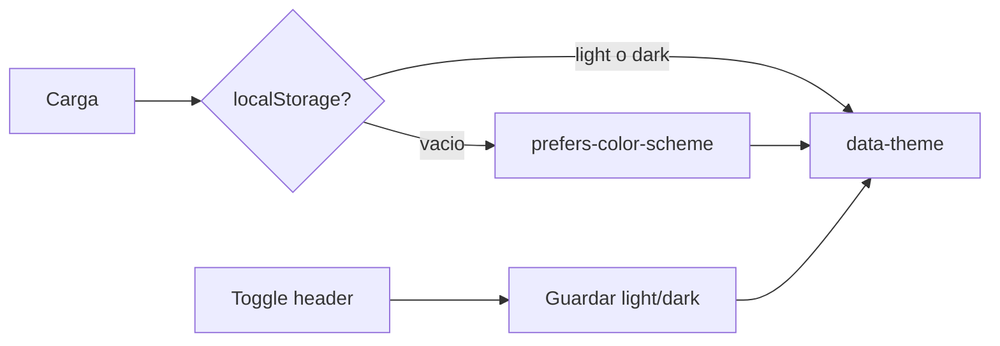

# Modo oscuro en Retrokit

Hoy toda la UI es un tema claro en [`frontend/src/styles.scss`](frontend/src/styles.scss). Casi todo ya usa `var(--color-*)`; el trabajo es un segundo set de tokens, un servicio de tema, y reemplazar los `white` / hex sueltos para que no queden superficies claras en oscuro.

Elección: **toggle en el header**. Primera visita (sin `localStorage`) **sigue el sistema**. Al toglear, se guarda `light` o `dark` en este navegador (`retrokit_theme`, mismo prefijo que [`auth.service.ts`](frontend/src/app/core/auth.service.ts)). No se sincroniza con la cuenta ni con el backend.

## Tokens

En [`styles.scss`](frontend/src/styles.scss):

- `color-scheme: light` en `:root` y `color-scheme: dark` en `[data-theme="dark"]` (inputs nativos, scrollbars).
- Bloque `[data-theme="dark"]` que redefine los tokens existentes. Paleta Trinomio: brand `#008ace` se mantiene; fondos azul-gris oscuros (no negro puro); `--color-sky-soft` pasa a un celeste muy apagado para columnas/chips (el `#e3f2fd` actual explotaría).
- Tokens nuevos usados en ambos temas:
  - `--color-danger-soft` (hover de `.btn-danger`, hoy `#ffebee`)
  - `--color-overlay` (backdrop del join modal)
  - `--color-focus-ring` (sticky seleccionada)
  - `--color-chrome` para barras translúcidas (`color-mix` sobre `--color-bg`)
  - `--color-toast-bg` / `--color-toast-fg` (hoy el toast usa `--color-text` + `white` y se rompería al invertir el texto)
- Inputs globales: `background`/`color` en `input, textarea, select` (hoy solo `.field` los pinta; el kanban de acciones tiene inputs sueltos).
- `@media print`: forzar `color-scheme: light` y tokens claros para el reporte.

## Servicio + anti-FOUC

Script inline en [`index.html`](frontend/src/index.html) **antes de** `<app-root>`: lee `retrokit_theme` o `matchMedia('(prefers-color-scheme: dark)')` y setea `data-theme` en `<html>`. Sin esto, Angular carga y hay un flash de tema claro.

[`ThemeService`](frontend/src/app/core/theme.service.ts) (`providedIn: 'root'`):

- `theme` signal `'light' | 'dark'`
- `toggle()` persiste y escribe `data-theme`
- Si no hay valor guardado, escucha `prefers-color-scheme` y actualiza

## Toggle

En [`app.ts`](frontend/src/app/app.ts), botón icono/texto (“Oscuro” / “Claro”) **siempre visible** en `.topbar-right` (logueado, invitado y landing). Fuera de los `@if` de auth para no duplicarlo.

`.logo` y fases activas: `color: var(--color-on-brand)` en lugar de `white`.

## Superficies hardcoded

Reemplazar literales para que hereden tokens:

- [`retro.page.scss`](frontend/src/app/pages/retro/retro.page.scss): `.sticky` (`white` → `--color-bg`), `.phase.active`, `.facilitator-bar`, `.copy-toast`, `.join-modal-backdrop`, anillo de selección
- [`actions.page.ts`](frontend/src/app/pages/actions/actions.page.ts): `.item` blanco; `.col.done` / `.unmet` (`#e8f4fc` / `#eef2f5`) → `--color-sky-soft` / `--color-bg-muted`
- [`team.page.ts`](frontend/src/app/pages/team/team.page.ts): `color: white` del “copiado” → `--color-on-brand`
- [`report.page.ts`](frontend/src/app/pages/report/report.page.ts): borde print `#ccc` → `--color-border`

Login, register, join, dashboard, templates y editor ya usan solo variables: con el bloque dark alcanzan (gradiente `sky-soft` → `bg-muted` incluido).

## Verificación

Sin tests frontend. En el browser, con y sin preferencia guardada:

- Toggle en header (guest, user, login) y recarga: el tema se mantiene
- OS en oscuro, primera visita (borrar `retrokit_theme`): arranca oscuro; al toglear deja de seguir el OS
- Retro: columnas, stickies, barra del facilitator, modal de join, toast de copiar
- Acciones: kanban e inputs
- Auth (gradiente) y print del reporte (sigue claro)
