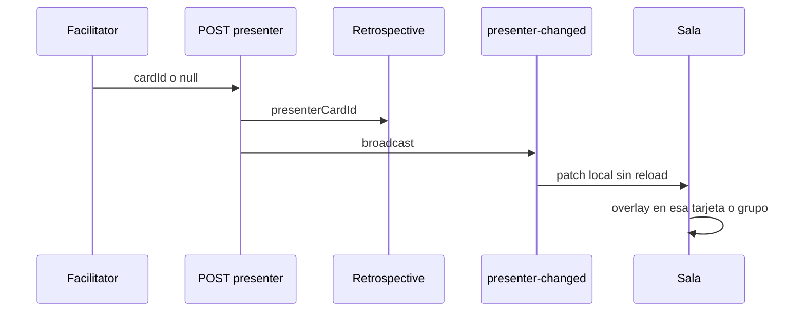

# Modo presentación en Plan de acción

El layout Neatro de 3 columnas ya está en producción. Este plan implementa el overlay de presentación **sobre esa vista**.

## Fuente del mazo

La columna **izquierda** son temas (secciones de la retro). La **del medio** son los comentarios: tarjetas sueltas y grupos, filtrados por los temas marcados + filtro de votos + orden.

El **mazo canónico** = esa columna del medio = `actionPlanItems()`:

- Una tarjeta suelta → una slide.
- Un **grupo** → **una slide** (no una slide por miembro).
- Orden y recorte = lo que el facilitator ve en el medio (temas seleccionados, votos, sort).

La lista de temas **no** es navegable ni presenta. Clic en un tema solo cambia qué tarjetas hay en el medio (y por tanto el mazo del facilitator).

Si el medio está vacío (ningún tema marcado, o ninguna tarjeta pasa el filtro), **Presentar** queda deshabilitado.

**Follow-me:** el facilitator recorre *su* columna del medio. Los demás no usan su filtro local para next/prev: ven el overlay de `presenterCardId` aunque esa tarjeta no esté en su medio. No hace falta sincronizar checkboxes de temas.

## Idea

El facilitator pone a toda la sala en modo presentación: overlay a pantalla completa con una slide a la vez, navegación sincronizada, todos ven lo mismo. Inspiración “follow me” de [Scrumlr](https://scrumlr.io/), más estricto (todos ven lo mismo).

Quien controla es el **facilitator del equipo** ya unido (`me.isFacilitator`). Invitados y no-facilitators siguen; espectadores también.

## Comportamiento

- Solo en fase `actions`. Al salir de fase, se limpia.
- Si `presenterCardId` está set, **todos** ven el overlay. Cierra solo el facilitator.
- Título del overlay = nombre de la columna/tema de la slide actual (el mismo header que ya tiene cada tarjeta del medio).
- Facilitator: **Presentar** en el meta-bar; clic en una **tarjeta del medio** para saltar a esa slide; flechas; `P` toggle; `←`/`→` (ignorar si foco en input). Participantes: ven “El facilitator está presentando”.
- **Slide tarjeta:** texto, autor si no anónima, votos. Sin editar/borrar.
- **Slide grupo (obligatorio):** una posición del mazo. Se ven **todos** los stickies miembros **juntos** en la misma slide (desplegados, no el mazo colapsado del medio). `←`/`→` pasa al **siguiente ítem del medio** (otra tarjeta u otro grupo), **nunca** al siguiente miembro del grupo. Votos del `groupId` una sola vez en el chrome. Identidad de la slide = `cardId` del header del grupo (como en `actionPlanItems`).
- Debajo: CTA que abre el **modal Create action** vinculado (`cardId` / `groupId`).

## Datos y API

En `Retrospective`: `presenterCardId String?`. Migración al estilo existente. Sin FK; validar al setear. `deleteCard` / `advancePhase` limpian. Si el id apunta al header de un grupo, la slide es de grupo.

- `POST /retros/:id/presenter` `{ cardId: string | null }`; `assertFacilitatorOfRetro`; solo `status === actions`.
- Emit `presenter-changed`; `getBoard` lo expone.

## Frontend

- Modelo + `setPresenter` en API.
- `presentationDeck()` = `actionPlanItems()` (columna del medio). Listener `presenter-changed` hace **patch** sin `reload`.
- Overlay sobre el layout de 3 columnas (z-index bajo el modal de acción / join).
- No reintroducir el board columnar en `actions`.

## Fuera de alcance

- Presentar en comentarios / agrupar / votar.
- Highlight tipo Scrumlr sin overlay, o navegación independiente por cliente.
- Reacciones / borrar desde el overlay.
- Recorrer miembros de un grupo como slides sueltas.
- Presentar desde la lista de temas de la izquierda.
