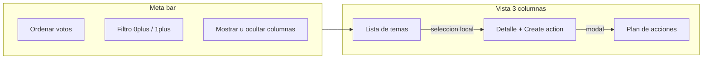

# Plan de acción estilo Neatro + Tablero de acciones

## Contexto

Hoy:

- Fase `actions` en la retro: board de columnas + [`.action-panel`](frontend/src/app/pages/retro/retro.page.html) abajo (título + owner). Sin descripción en UI, sin due date, **sin vínculo a tarjeta**.
- [`ActionItem`](backend/prisma/schema.prisma): `title`, `description?`, `ownerId?`, `status`, `teamId`, `retroId?`.
- Tablero del equipo ([`actions.page.ts`](frontend/src/app/pages/actions/actions.page.ts)): Kanban 4 columnas con botones Cumplido / No cumplido / En curso / Pendiente; la card solo muestra título + assignee.

Se reformatea la fase de la retro al layout Neatro y se rediseña el tablero del equipo. El [modo presentación](.cursor/plans/modo_presentacion_ce7b5dff.plan.md) se apoya en la columna del medio de este módulo.

## 1. Fase Plan de acción (retro) — layout Neatro

- **Izquierda:** ítems del board (tarjeta suelta o **un grupo = una fila**), **multi-select**, votos, sección + preview. Orden `sortMode`. Filtros: ocultar sin votos (`1+`); mostrar/ocultar por columna.
- **Centro:** todas las tarjetas de los temas seleccionados **juntas** (no agrupadas por columna). Cada tarjeta tiene título de sección y **Crear acción** propio. Ordenan por más/menos votos u original. Espectadores solo lectura.
- **Derecha:** `actionItems` de **esta retro** (título, assignee, due date, chip de origen) + **+ Agregar** sin vínculo.
- Tablero del equipo: filtro por retro (default: la más reciente); crear acción exige `retroId`.
- Se **elimina** el panel inferior y el board columnar **solo en `actions`**.

## 2. Tablero de acciones (equipo)

Rediseño completo de [`actions.page.ts`](frontend/src/app/pages/actions/actions.page.ts):

- **Quitar** la fila de botones de status (`.outcome` / `.moves`: Cumplido, No cumplido, En curso, Pendiente, Reabrir). El trash del facilitator se mantiene (con `stopPropagation`).
- **Card compacta:** título, descripción (truncada si es larga), assignee, fecha de fin. Sin botones de movimiento.
- **Click en la card** → abre el **mismo modal** de edición (ver §4): comentario vinculado (si hay `card`/`group`), assignee, due date, título, descripción. Guardar → `PATCH` team action.
- **Drag-and-drop** entre las 4 columnas para cambiar `status` (reemplaza los botones). Dependencia nueva: `@angular/cdk` (misma major que Angular 22) y `DragDropModule` / `cdkDropList` + `cdkDrag` por columna. Al soltar → `updateAction(..., { status })`. Distinguir click vs drag (umbrál CDK / solo abrir modal si no hubo drag).
- Quick-add superior (input "Nueva acción") se mantiene para crear rápido solo con título; el resto se edita en el modal. Alternativa al crear: abrir modal vacío — se prioriza **quick-add + modal al click**.

## 3. Modelo de datos

En `ActionItem`:

- `dueDate DateTime?`
- `cardId String?` → `Card` (`onDelete: SetNull`)
- `groupId String?` → `CardGroup` (`onDelete: SetNull`)
- Invariante (como `Vote`): a lo sumo uno de `cardId` / `groupId`; grupo → un solo accionable para todo el grupo.

Migración Prisma nueva. `getBoard` y `listForTeam` incluyen `card` / `group` (+ miembros del grupo) + `owner`.

## 4. API

- [`CreateActionFromRetroDto`](backend/src/retros/dto/retros.dto.ts) / `createAction`: `description?`, `dueDate?`, `cardId?`, `groupId?` (XOR); validar pertenencia a la retro.
- [`CreateTeamActionDto` / `UpdateActionDto`](backend/src/actions/dto/action.dto.ts): `dueDate?`; update ya soporta title/description/owner/status — sumar `dueDate`.
- Prefill al crear desde card: título ≈ contenido; descripción vacía; linked block en modal.

Socket: sigue `action-created` + reload en la retro. El Kanban del equipo es HTTP (reload local tras patch/drop).

## 5. Frontend compartido

- Modelos: `dueDate?`, `cardId?`, `groupId?`, `card?`, `group?` en [`ActionItem`](frontend/src/app/core/models/index.ts).
- API client: pasar campos nuevos en create/update/list.
- **Modal compartido** (componente en `frontend/src/app/shared/`, p.ej. `action-item-modal`): título, descripción, assignee (select de miembros del equipo o participantes de la retro según contexto), due date, bloque read-only **Comentario vinculado** (card o miembros del grupo). Modos create (retro) y edit (tablero; también create desde retro con link).
- Retro: layout `.action-plan` + helpers `actionPlanItems()`, filtros, selección; modal create.
- Report: mostrar due date si existe.

## 6. Modo presentación

Este plan ya está cerrado. El overlay vive en [modo presentación](.cursor/plans/modo_presentacion_ce7b5dff.plan.md):

- Mazo = columna del **medio** (`actionPlanItems`), no los temas de la izquierda ni el board columnar viejo.
- Un grupo = una slide con todos los miembros juntos.
- Create action del overlay = este modal con `cardId`/`groupId`.

## Fuera de alcance

- Campo Topic independiente en el accionable.
- Vincular varias cards no agrupadas al mismo action.
- Checkbox persistido "ya discutido" / SMART Neatro.
- Implementar modo presentación ahora.
- Reordenar cards *dentro* de la misma columna (solo cambio de status por drop a otra columna).
- Realtime en el Kanban del equipo.

## Verificación

**Retro**

- 3 columnas; filtros de votos y secciones; sort.
- Create desde card/grupo → link correcto; + Agregar sin link.
- Assignee + due date en lista derecha.

**Tablero equipo**

- Cards muestran descripción, assignee, due date; sin botones de status.
- Click abre modal con linked comment (si aplica) y permite editar.
- Arrastrar Pendiente → En curso / Cumplido / No cumplido actualiza status.
- Trash facilitator no abre el modal.

**Datos**

- Borrar card vinculada → action vive con link null.
- Socket `action-created` refresca al otro cliente en la retro.
