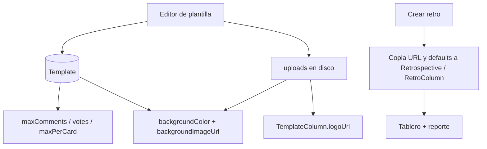

# Plantillas Parte 2 — fondo, defaults y logos

Depende de que la **Parte 1** (ABM de plantillas con columnas nombre/descripción/icono) ya esté hecha. Esta entrega no cambia quién edita plantillas (sigue siendo facilitator de algún equipo) ni el modelo de snapshot de columnas.

Hoy el tablero es CSS fijo ([`retro.page.scss`](frontend/src/app/pages/retro/retro.page.scss)), los límites se tipear a mano en [`team.page.ts`](frontend/src/app/pages/team/team.page.ts) (3 / 5 / 2), y el “logo” de columna es un string en [`icon`](backend/prisma/schema.prisma) renderizado como texto.

---

## 1. Schema (migración Prisma)

**`Template`** — defaults de facilitación + fondo:

- `maxCommentsPerParticipant Int?` (null = ilimitado, igual que en la retro)
- `votesPerParticipant Int` default `5`
- `maxVotesPerCard Int` default `2`
- `backgroundColor String?` (hex, p. ej. `#0b3d5c`)
- `backgroundImageUrl String?` (ruta pública del archivo)

**`TemplateColumn`** — no reutilizar `icon`:

- `logoUrl String?` — PNG o SVG subido
- `icon` queda como fallback de texto/símbolo (Parte 1)

**`Retrospective`** — snapshot de fondo (la retro ya tiene los tres límites):

- `backgroundColor String?`
- `backgroundImageUrl String?`

**`RetroColumn`**:

- `logoUrl String?`

Seed: rellenar los tres defaults de las plantillas actuales con `3`, `5` y `2` para alinearlos al form de crear retro. Sin imágenes.

Al **crear la retro** en [`retros.service.ts`](backend/src/retros/retros.service.ts):

- Copiar `backgroundColor` / `backgroundImageUrl` al registro de la retro
- Copiar `logoUrl` junto con `title`, `description`, `icon`
- Si el DTO no manda un límite, usar el de la plantilla; si la plantilla tampoco, los defaults actuales (`null` / `5` / `2`)

Editar la plantilla **no** mueve retros ya creadas: las URLs se copian como string. Los archivos se guardan con nombre único (`uuid.ext`) para que un recambio de logo/fondo no pise el archivo de una retro vieja.

---

## 2. Storage de archivos

No hay uploads hoy. Disco local, servido por la API (nginx ya proxya solo `/api` y `/socket.io` en [`frontend/nginx.conf`](frontend/nginx.conf)).

- Directorio `UPLOAD_DIR` (env, default `./uploads`)
- Volumen Docker en el servicio `api`
- Estáticos Nest en **`/api/uploads/...`** (así no hace falta un `location` extra en nginx)
- Endpoints (facilitator), multipart con Multer:

  - `POST /templates/:id/background` — imagen de fondo
  - `DELETE /templates/:id/background`
  - `POST /templates/:id/columns/:columnId/logo`
  - `DELETE /templates/:id/columns/:columnId/logo`

  El color de fondo va en el `PATCH /templates/:id` JSON (no es archivo).

Límites:

- Logos: `image/png`, `image/svg+xml`, máx. **1 MB**
- Fondo: `image/png`, `image/jpeg`, `image/webp`, `image/svg+xml`, máx. **5 MB**
- Render siempre con `` (nunca inline SVG) para no ejecutar scripts
- `Content-Type` correcto; no servir SVG como HTML

Al borrar plantilla (solo si no está en uso, Parte 1) o al reemplazar archivo: borrar el archivo viejo si ninguna retro lo referencia; si hay duda, dejar el huérfano (aceptable en v1).

---

## 3. Editor de plantillas (extender Parte 1)

En `/templates/:id` (la plantilla tiene que existir: en **nueva**, primero guardar y después subir archivos).

**Defaults** (misma grilla que crear retro):

- Máx. comentarios / persona
- Votos por persona
- Máx. votos por comentario/tarjeta

**Fondo** (estilo Neatro: color de escena + imagen opcional a `cover`):

- Color picker + hex
- Upload / quitar imagen
- Preview chico del tablero (color + imagen + columnas)

**Logo por columna:**

- File input PNG/SVG si la columna ya tiene `id`
- Preview 40×40; si no hay `logoUrl`, seguir mostrando `icon`
- Quitar logo vuelve al icono de texto

---

## 4. Crear retro y tablero

[`team.page.ts`](frontend/src/app/pages/team/team.page.ts): al cambiar la plantilla, **prefill** `maxComments`, `votesPerParticipant`, `maxVotesPerCard`. El facilitator puede overridear; lo que manda el form gana.

Preview del picker: logo `` si hay `logoUrl`, si no el `icon`.

[`retro.page.html`](frontend/src/app/pages/retro/retro.page.html) + scss:

- El `.retro-shell` (o un wrapper a pantalla completa bajo el topbar) usa `background-color` y `background-image` del snapshot
- Columnas un poco translúcidas para que se lea el fondo y las stickies sigan blancas
- Header de columna: `` o el `` actual

Mismos logos en el reporte ([`report.page.ts`](frontend/src/app/pages/report/report.page.ts)). El fondo del board **no** hace falta en el reporte imprimible.

No hay editor de fondo/logo **dentro** de una retro en vivo: se elige en la plantilla y se congela al crear. Los límites de votos/comentarios ya se editan en Ajustes del facilitator.

---

## 5. Fuera de alcance

- Paleta de wallpapers precargados tipo marketplace Neatro (solo color + upload propio)
- GIF / video de fondo
- Logo distinto por retro sin cambiar la plantilla
- CDN / S3 (disco local alcanza para este deploy)
