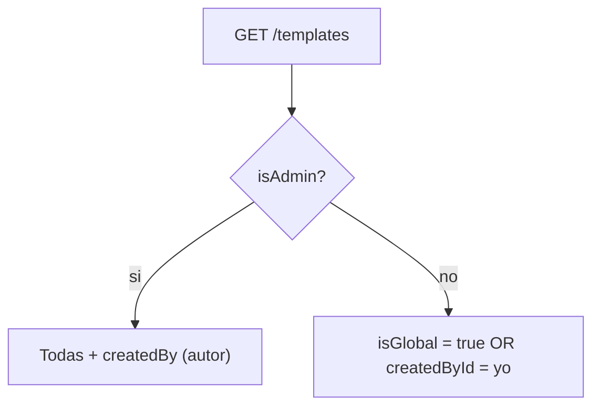

## Plantillas universales + personales

## Modelo de visibilidad

- **Universal**: `isGlobal = true`. Las del seed y las que crea el admin. Las ve y usa todo el mundo.
- **Personal**: `isGlobal = false` + `createdById = userId`. Solo la ve su autor (y el admin). Como crear retros ya es facilitator-only, queda disponible únicamente en los equipos donde su autor es facilitator, sin necesidad de scoping por equipo.

Decisiones cerradas: crear plantillas requiere ser **facilitator de al menos un equipo** (o admin); cuando el admin edita una plantilla personal, **sigue siendo personal** de su autor (nunca se cambia `isGlobal` / `createdById` en un update).



## Schema y migración

En [`backend/prisma/schema.prisma`](backend/prisma/schema.prisma), sobre `model Template`:

```prisma
  isGlobal    Boolean @default(false)
  createdById String?
  createdBy   User?   @relation("TemplateCreator", fields: [createdById], references: [id], onDelete: SetNull)
```

Y en `model User`: `createdTemplates Template[] @relation("TemplateCreator")`.

Migración nueva en `backend/prisma/migrations/`: agrega las dos columnas, el FK con `ON DELETE SET NULL`, y backfill `UPDATE "Template" SET "isGlobal" = true;` (todo lo que existe hoy es del seed, o sea universal).

## Seed (bug a evitar)

[`backend/prisma/seed.js`](backend/prisma/seed.js) (el que corre en el entrypoint) y [`backend/prisma/seed.ts`](backend/prisma/seed.ts) buscan por nombre con `findFirst({ where: { name } })`, así que una plantilla personal llamada igual que una del seed sería sobreescrita. Scopear la búsqueda y la creación:

```js
let row = await prisma.template.findFirst({ where: { name: t.name, isGlobal: true } });
// ... create: data: { ..., isGlobal: true }
```

## Backend: autorización de plantillas

Todo en [`backend/src/templates/templates.service.ts`](backend/src/templates/templates.service.ts).

- `list(userId)`: si admin → todas con `include: { columns, createdBy: { select: { id, name, email } } }`; si no → `where: { OR: [{ isGlobal: true }, { createdById: userId }] }`.
- `getOne(id, userId)`: además del 404 actual, `NotFoundException` si no es global, ni propia, ni el actor es admin (evita leakear plantillas ajenas por id).
- `create(userId, dto)`: reemplazar `assertAdmin` por:
  - admin → `isGlobal: true`, `createdById: userId`
  - si no → `await this.teams.assertAnyFacilitator(userId)`, `isGlobal: false`, `createdById: userId`
- Nuevo helper privado `assertCanManage(userId, templateId)`: pasa si es admin o si `createdById === userId`, si no `ForbiddenException`. Usarlo en lugar de `assertAdmin` en `update`, `remove`, `uploadBackground`, `clearBackground`, `uploadColumnLogo`, `clearColumnLogo`.
- `update` no toca nunca `isGlobal` ni `createdById`.
- `remove` mantiene el bloqueo actual "hay retrospectivas que usan esta plantilla".
- Staging (`saveStaging`, `deleteStagingFile`, `deleteStagingSession`): cambiar `assertAdmin` por "admin o facilitator-anywhere" (misma condición que `create`). Los archivos ya están aislados por `userId` en [`uploads.service.ts`](backend/src/uploads/uploads.service.ts), así que no hay riesgo cruzado.

El controller [`templates.controller.ts`](backend/src/templates/templates.controller.ts) solo cambia en que `list` y `getOne` pasan a recibir `user.sub`.

## Backend: crear retro con plantilla personal

En [`backend/src/retros/retros.service.ts`](backend/src/retros/retros.service.ts) `create` hoy hace `template.findUnique({ where: { id: dto.templateId } })`. Scopear para que un facilitator no pueda usar la plantilla personal de otro:

```ts
const admin = await this.teams.isAdmin(userId);
const template = await this.prisma.template.findFirst({
  where: {
    id: dto.templateId,
    ...(admin ? {} : { OR: [{ isGlobal: true }, { createdById: userId }] }),
  },
  include: { columns: { orderBy: { position: 'asc' } } },
});
```

Las retros ya snapshotean columnas, fondo y logos, así que una retro creada con plantilla personal sigue funcionando para todo el equipo.

## Backend: borrado de usuarios

En `deleteUserAsAdmin` de [`backend/src/teams/teams.service.ts`](backend/src/teams/teams.service.ts), antes del `user.delete` de la transacción, borrar las plantillas personales del usuario que no estén en uso:

```ts
this.prisma.template.deleteMany({
  where: { createdById: targetUserId, isGlobal: false, retrospectives: { none: {} } },
}),
```

Las que sí tienen retros quedan con `createdById = null` (por el `SetNull`) y `isGlobal = false`: invisibles para los usuarios y administrables solo por el admin.

## Frontend

- [`frontend/src/app/core/models/index.ts`](frontend/src/app/core/models/index.ts): en `Template` agregar `isGlobal: boolean`, `createdById?: string | null`, `createdBy?: { id: string; name: string; email: string } | null`.
- [`frontend/src/app/core/auth.guard.ts`](frontend/src/app/core/auth.guard.ts): nuevo `templateEditorGuard` que deja pasar si `ensureAdmin()` o `ensureFacilitator()` resuelven true, si no redirige a `/templates`.
- [`frontend/src/app/app.routes.ts`](frontend/src/app/app.routes.ts): `templates/new` y `templates/:id` pasan de `adminGuard` a `templateEditorGuard`. `/templates` sigue con solo `authGuard`.
- [`frontend/src/app/pages/templates/templates.page.ts`](frontend/src/app/pages/templates/templates.page.ts):
  - `canCreate()` = admin o facilitator (reusar `auth.ensureFacilitator()` en `ngOnInit` para tener el flag); el botón "Nueva plantilla" usa eso en vez de `isAdmin()`.
  - `canManage(tpl)` = `isAdmin() || tpl.createdById === auth.user()?.id`; los botones editar/borrar usan eso.
  - Dos secciones: "Universales" (`isGlobal`) y "Mis plantillas" (el resto), con un `<h2>` cada una.
  - Badge en la card: "Universal" si `isGlobal`; para el admin, el nombre del autor (`tpl.createdBy?.name`) en las personales; "Sin autor" si quedó huérfana.
  - Subtítulo de la página: reemplazar "Plantillas globales de retrospectiva..." por algo que refleje universales + personales.
- El link Plantillas de la rail ya es visible para todos, no cambia.

## Verificación

Rebuild de `api` y `web` con `docker compose up -d --build api web` y avisar `http://localhost:8090`. Casos a probar: facilitator crea plantilla y la ve solo él; otro facilitator no la ve ni al crear retro; admin ve todas con autor y puede editar/borrar; retro creada con plantilla personal sigue visible para todo el equipo.
