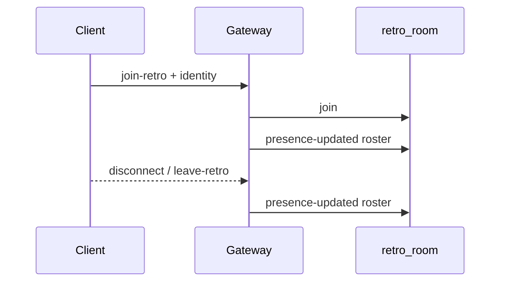

# Presencia en vivo en la barra de la retro

## Alcance

Mostrar **quién está conectado ahora** (socket en la room), no el roster persistente de `participants` en DB. Incluye **usuarios registrados y guests** con identidad de participante. **Espectadores anónimos** no aparecen (pueden ver la lista si están en la room).

## Estado actual

- Join de room ya existe en [`backend/src/realtime/realtime.gateway.ts`](backend/src/realtime/realtime.gateway.ts) (`join-retro` / `leave-retro`), pero no guarda identidad ni emite roster.
- JWT de **user** solo setea `client.data.userId`; JWT de **guest** se ignora en el gateway (aunque trae `participantId`, `name`, `avatarId`).
- Header: [`frontend/src/app/pages/retro/retro.page.html`](frontend/src/app/pages/retro/retro.page.html) → `.header-actions`; el invite es el primer botón. Reusar [`UserAvatarComponent`](frontend/src/app/shared/user-avatar.component.ts) (`title` = nombre en hover).



## Backend

En [`realtime.gateway.ts`](backend/src/realtime/realtime.gateway.ts):

1. **`handleConnection`**: parsear JWT `user` y `guest`.
   - `user` → `userId`, `name`, `avatarId`, `type`
   - `guest` → `participantId`, `name`, `avatarId`, `retroId`, `type`
2. **`join-retro`**: body `{ retroId, participantId?, name?, avatarId? }`.
   - Guardar `client.data.retroId` + identidad (payload del cliente pisa name/avatar si vienen; `participantId` obligatorio para figurar en presencia).
   - Guest: si el JWT trae `retroId`, rechazar join a otra retro.
   - Tras join → `broadcastPresence(retroId)`.
3. **`leave-retro` / `handleDisconnect`**: limpiar `client.data.retroId` y re-emitir presencia de esa room.
4. **`broadcastPresence`**: `server.in(room).fetchSockets()`, dedupe por `participantId` (una entrada por persona aunque haya varias pestañas), emitir:

```ts
{ participants: Array<{ participantId: string; name: string; avatarId?: string | null; userId?: string | null }> }
```

Evento: `presence-updated`.

Sin Prisma en el gateway: la identidad la manda el cliente al unirse (ya la tiene del board / JWT guest).

## Frontend

1. [`socket.service.ts`](frontend/src/app/core/socket.service.ts): extender `joinRetro(retroId, presence?)` para emitir identity; al `connect`/reconnect reenviar identity si está guardada.
2. [`retro.page.ts`](frontend/src/app/pages/retro/retro.page.ts):
   - Signal `presence = signal<PresenceUser[]>([])`.
   - Escuchar `presence-updated` (no va en `boardEvents` / no hace reload).
   - Tras cargar board (y tras join HTTP exitoso), si hay `me.participantId`, llamar `joinRetro` con `{ participantId, name, avatarId, userId? }`.
   - En `avatar-changed`, actualizar avatar/nombre en el signal local si coincide.
   - Helpers `visiblePresence` / `+N` (máx. ~5), estilo team.
3. [`retro.page.html`](frontend/src/app/pages/retro/retro.page.html): antes del botón Invitar, stack de avatares (también visible para espectadores, fuera del `@if (!isSpectator())` del invite):

```html
@if (presence().length) {
  <div class="presence-avatars" aria-label="Conectados">
    @for (p of visiblePresence(); track p.participantId) {
      <app-user-avatar ... [name]="p.name" size="sm" />
    }
    <!-- +N con title de nombres ocultos -->
  </div>
}
```

4. [`retro.page.scss`](frontend/src/app/pages/retro/retro.page.scss): `.presence-avatars` con gap chico entre avatares y **`margin-right` ~0.55–0.75rem** antes del invite, para no leerse como botón de toolbar. Sin sombra/borde de botón; avatares circulares como el resto de la app.

## Defaults concretos

| Decisión | Valor |
|----------|--------|
| Quién aparece | Solo con `participantId` (miembros + guests) |
| Multi-tab | Una sola entrada por `participantId` |
| Overflow | Máx. 5 avatares + `+N` |
| Tooltip | `title` nativo vía `UserAvatarComponent` |
| Espectadores | Ven la lista; no aparecen si no son participantes |

## Verificación

Rebuild `api` + `web` (Docker). Abrir la misma retro en dos browsers/perfiles → ambos ven los avatares; al cerrar una pestaña, desaparece; hover muestra el nombre. URL: `http://localhost:8090`.
