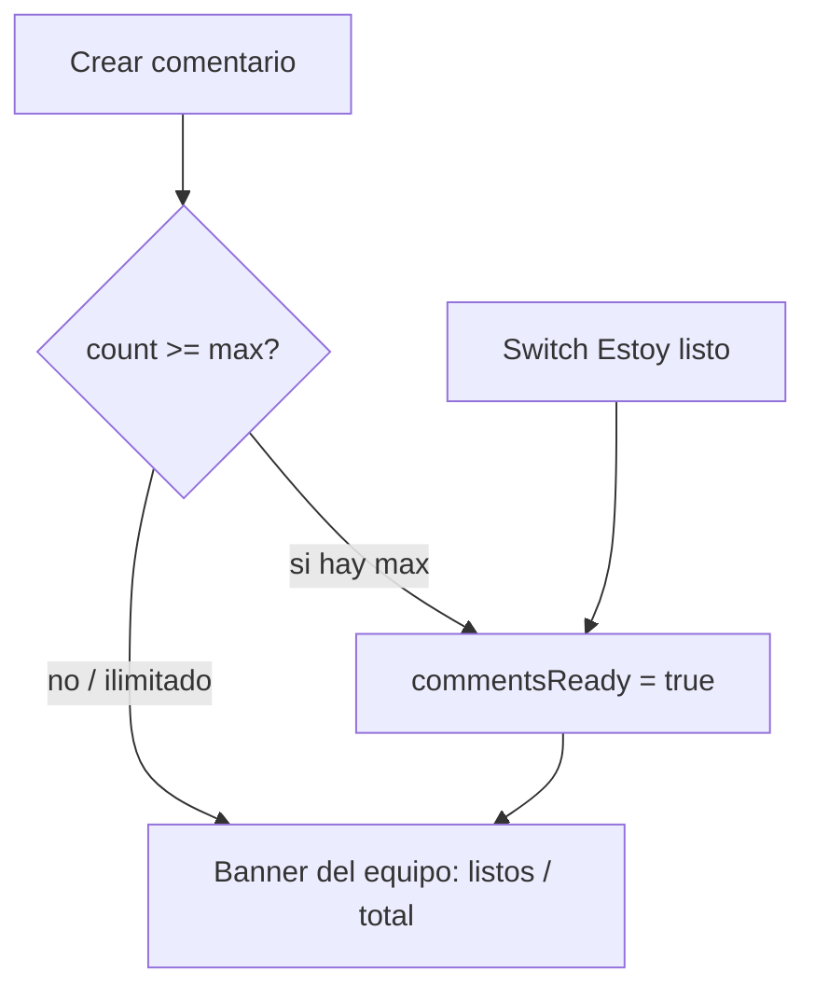

# Listo al completar comentarios (o con switch)

El bug es real: en [`getBoard()`](backend/src/retros/retros.service.ts) `hasWritten` es `commentCount > 0`, así que con 1/4 ya aparece ✓ y “¡Todos escribieron!”. El switch encaja bien: a veces alguien termina antes del cupo, y si no lo marca, el sistema lo hace al llegar al máximo.

## Comportamiento

- El check del banner usa **listo**, no “tiene al menos 1 comentario”. El número entre paréntesis (`Nicolas (1)`) sigue mostrando cuántos escribió.
- **Switch “Estoy listo”** junto a `Tus comentarios: X / Y`. Se puede activar antes de llegar al máximo (por si ya no tenés más para decir).
- **Auto:** al crear un comentario, si hay `maxCommentsPerParticipant` y el conteo llega al tope, se setea `commentsReady = true`.
- **Ilimitado** (`max` = null): no hay auto; solo el switch.
- **Borrar un comentario no te saca de listo.** Si ya marcaste (o te auto-marcó), seguís listo hasta que apagues el switch. Así no se desmarca si borrás uno para reescribirlo.
- Si llegaste al máximo, el switch queda **prendido y deshabilitado** (no tiene sentido apagarlo: no podés escribir más).
- Copy del banner: `Listos: X / Y · ¡Todos listos!` (más fiel que “escribieron”).

## Backend

- [`backend/prisma/schema.prisma`](backend/prisma/schema.prisma): en `Participant`, `commentsReady Boolean @default(false)` + migración nueva.
- [`backend/src/retros/retros.service.ts`](backend/src/retros/retros.service.ts):
  - `getBoard()`: `isReady: p.commentsReady`; el contador del equipo usa `isReady`. Exponer `me.commentsReady`.
  - `createCard()`: después de crear, si `count >= max`, update `commentsReady: true`.
  - Nuevo `setCommentsReady(user, retroId, ready)` (solo fases `comments` / `grouping`). Si `ready === false` y ya está al máximo, rechazar o no-op (el switch estará disabled).
- [`backend/src/retros/retros.controller.ts`](backend/src/retros/retros.controller.ts) + DTO: `PATCH /retros/:id/me/ready` con `{ ready: boolean }`.
- Emitir `comments-ready-changed` (el `card-created` ya recarga el board en el auto-caso).

## Frontend

- Modelos en [`frontend/src/app/core/models/index.ts`](frontend/src/app/core/models/index.ts): `isReady` en el participante del progreso; `me.commentsReady`.
- [`api.service.ts`](frontend/src/app/core/api.service.ts): `setCommentsReady(id, ready)`.
- [`retro.page.html`](frontend/src/app/pages/retro/retro.page.html) / [`.ts`](frontend/src/app/pages/retro/retro.page.ts) / [`.scss`](frontend/src/app/pages/retro/retro.page.scss): switch “Estoy listo” en la meta-bar; checkmarks con `isReady`; escuchar el socket y recargar.

## Verificación

Probar en el browser: 1/4 no marca listo; switch manual sí; 4/4 auto-prende y bloquea el switch; otro cliente ve el cambio en vivo; borrar un comentario no apaga el estado hasta que lo apagues vos.