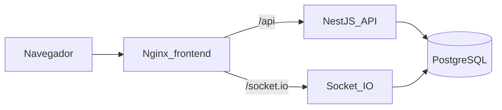
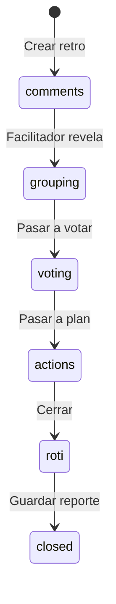

# Retrokit: retrospectivas tipo Neatro

Producto nuevo en [`/Users/macbook/Documents/retrokit`](/Users/macbook/Documents/retrokit). Monorepo con dos apps dockerizadas: `frontend/` (Angular 22) y `backend/` (NestJS + PostgreSQL).

Neatro no se clona 1:1. Se replica el flujo que hace útil la herramienta: **Comentarios → Agrupar → Votar → Plan de acción → Cierre**, con invitación por enlace, plantillas, ROTI y seguimiento de acciones. Quedan fuera de esta versión: IA para agrupar, icebreakers, health checks, analíticas avanzadas e integraciones (Jira, GitHub, etc.).

## Stack

- **Frontend:** Angular **22** (última estable), standalone + signals, routing, SCSS. UI en español, tablero colaborativo y paleta azul/celeste de [trinom.io](https://trinom.io/) (tipografía Open Sans).
- **Backend:** NestJS (TypeScript) sobre **Node 22** (mínimo que exige Angular CLI 22: Node `>= 22.22`). REST + WebSocket (`@nestjs/websockets` + Socket.IO) para el tablero en vivo.
- **Datos:** PostgreSQL 16 + Prisma (esquema y migraciones).
- **Auth:** registro/login JWT para facilitadores; participantes pueden unirse con **enlace + nombre** (token de invitado, sin cuenta).
- **Docker:** Compose de producción local (`web` + `api` + `db`). Nginx sirve el build de Angular y hace proxy de `/api` y `/socket.io`.

## Estructura

```
retrokit/
  frontend/          # Angular 22
  backend/           # NestJS + Prisma
  docker-compose.yml
  .env.example
  README.md
```

Tras crear la carpeta e inicializar git, el agente se moverá al proyecto con `move_agent_to_root` **antes** de scaffold e implementación.

## Identidad visual (trinom.io)

La UI se basa en la paleta real del sitio [trinom.io](https://trinom.io/), no en azules genéricos. Tokens CSS globales en `frontend/src/styles.scss`:

- **Marca / CTA:** `#008ACE` — botones primarios, links activos, acentos, fases actuales, logo
- **Marca hover:** `#0077B3`
- **Celeste suave:** `#E3F2FD` — fondos de columnas, chips, estados seleccionados, header suave
- **Celeste medio:** `#7EC8E8` — bordes, tags de plantilla, barra de progreso de votos
- **Fondo página:** `#FFFFFF`
- **Fondo muted:** `#F8F8F8`
- **Texto:** `#1A1A1A` / muted `#555555`
- **Sobre marca:** `#FFFFFF`

Patrones de UI tomados de Trinomio: botones primarios sólidos (`#008ACE` + texto blanco), botones secundarios ghost (borde y texto `#008ACE`, fondo transparente), cards con esquinas redondeadas, hover de nav en marca. Las columnas del tablero usan tintes de la misma familia (celeste suave) para no romper la paleta con colores tipo “verde/rojo de retro clásico”; se diferencian por icono y título, no por un arcoíris.

Tipografía: **Open Sans** (la misma que usa trinom.io).

## Arquitectura




El facilitador avanza las fases; el backend emite el estado a todos los participantes de la sala `retro:{id}`.




## Modelo de datos (esencial)

- `User`, `Team`, `TeamMember` (roles: `facilitator` | `member`)
- `Template` + `TemplateColumn` (semilla de 5 plantillas)
- `Retrospective` (`status`: comments | grouping | voting | actions | roti | closed) y **ajustes de facilitación** editables por el facilitador al crear y durante la sesión:
  - `maxCommentsPerParticipant` (null = sin límite)
  - `votesPerParticipant` (votos totales que puede repartir cada persona)
  - `maxVotesPerCard` (tope de votos de un mismo participante sobre una sola tarjeta/grupo)
- `Participant` (usuario o invitado), `Card`, `CardGroup`, `Vote`
- `ActionItem` (estado: pending | doing | done; dueño opcional; ligado al equipo y a la retro)
- `RotiResponse` (puntuación 1–5 + comentario opcional)

Plantillas iniciales: **Start / Stop / Continue**, **4Ls**, **Mad / Sad / Glad**, **Keep / Drop / Start**, **Went Well / To Improve / Ideas**.

## Herramientas de facilitación

Configurables al crear la retro y desde un panel del facilitador durante la sesión (cambios en vivo). El backend es la fuente de verdad: la UI deshabilita acciones y muestra el motivo, pero no se puede saltar el límite.

- **Límite de comentarios:** máximo de cards por participante en la fase Comentarios (vacío = ilimitado). Al llegar al tope, el botón de añadir se desactiva.
- **Límite de votos por participante:** bolsa de votos a repartir (p. ej. 5). Contador visible de votos restantes.
- **Límite de votos por tarjeta:** un participante no puede apilar más de N votos en la misma card o grupo. Si el tope por tarjeta es menor que el total personal, hay que repartir.
- **Ordenar en Plan de acción:** control en el tablero para ordenar por **más votados** (default), menos votados u orden original / por columna. Aplica a cards y grupos ya revelados; no cambia votos, solo la vista para discutir.

Valores por defecto al crear: 3 comentarios, 5 votos por persona, 2 votos por tarjeta (el facilitador puede dejarlos en “sin límite”).

## Pantallas (Angular)

- Auth: login / registro
- Dashboard: equipos, retrospectivas recientes, acciones pendientes
- Equipo: miembros, historial, crear retro eligiendo plantilla
- Sala de retro:
  - barra de fases + timer (controlado por el facilitador)
  - tablero por columnas; en **Comentarios** las cards ajenas no se revelan hasta agrupar; tope de cards por participante visible en el composer
  - **Agrupar:** arrastrar una card sobre otra (sin IA)
  - **Votar:** cada participante ve votos restantes; resultados de terceros ocultos hasta el siguiente paso. El backend rechaza votos que superen el total por persona o el tope por tarjeta.
  - **Plan de acción:** selector de orden (**más votados**, menos votados, orden original/por columna). Por defecto más votados. Crear acciones y asignar dueño.
  - panel de ajustes del facilitador (límites y timer), aplicable en vivo vía Socket.IO
  - invitar (enlace miembro / enlace invitado)
- Cierre: ROTI anónimo + reporte (comentarios, grupos, votos, acciones, promedio ROTI); vista imprimible desde el navegador
- Tablero Kanban de acciones del equipo (pendiente / en curso / hecho), con recordatorio de acciones abiertas al crear la siguiente retro

## API (resumen)

- `POST /auth/register|login`, `GET /me`
- CRUD ligero de equipos y miembros
- `POST /retros` (templateId + ajustes: `maxCommentsPerParticipant`, `votesPerParticipant`, `maxVotesPerCard`, anónimo, timer)
- `PATCH /retros/:id/settings` (solo facilitador; emite `settings-changed`)
- `POST /retros/:id/join` (código/token de invitación)
- Cards, grupos, votos, action items, avance de fase (solo facilitador). Crear card y votar validan límites en servidor.
- `POST /retros/:id/roti`, `GET /retros/:id/report`
- Gateway Socket.IO: `join-retro`, `phase-changed`, `card-*`, `votes-updated`, `settings-changed`, `timer-*`

## Docker para servidor local

[`docker-compose.yml`](/Users/macbook/Documents/retrokit/docker-compose.yml):

- `db`: Postgres 16, volumen persistente
- `api`: multi-stage `node:22-alpine`, `prisma migrate deploy` al arrancar, puerto interno 3000
- `web`: build Angular → `nginx:alpine`, SPA fallback (`try_files`), proxy `/api` y `/socket.io`

Un solo comando: `docker compose up --build`. Exponer `80` (o `8080`) en el host. `.env.example` con `JWT_SECRET`, `DATABASE_URL`, `CORS_ORIGIN`.

Dockerfiles de desarrollo no son el objetivo; el Compose es el artefacto para subir al servidor. El README documentará también `ng serve` + `nest start:dev` para iterar en local.

## Fuera de alcance (esta versión)

Icebreakers, agrupación por IA, Team Radars, analíticas de tendencias, PDF/CSV nativos, SSO, multi-organización, integraciones de export a Jira/GitHub.

## Orden de implementación

1. Crear `/Users/macbook/Documents/retrokit`, git, `move_agent_to_root`.
2. Scaffold Angular 22 y NestJS + Prisma + Postgres en Compose.
3. Auth, equipos e invitaciones.
4. Motor de retro (fases, cards, agrupación, votos, límites, ordenamiento en plan de acción, timer, realtime).
5. Plantillas, ROTI, reporte, tablero de acciones.
6. Dockerfiles de producción, Nginx, README de despliegue en servidor local.

