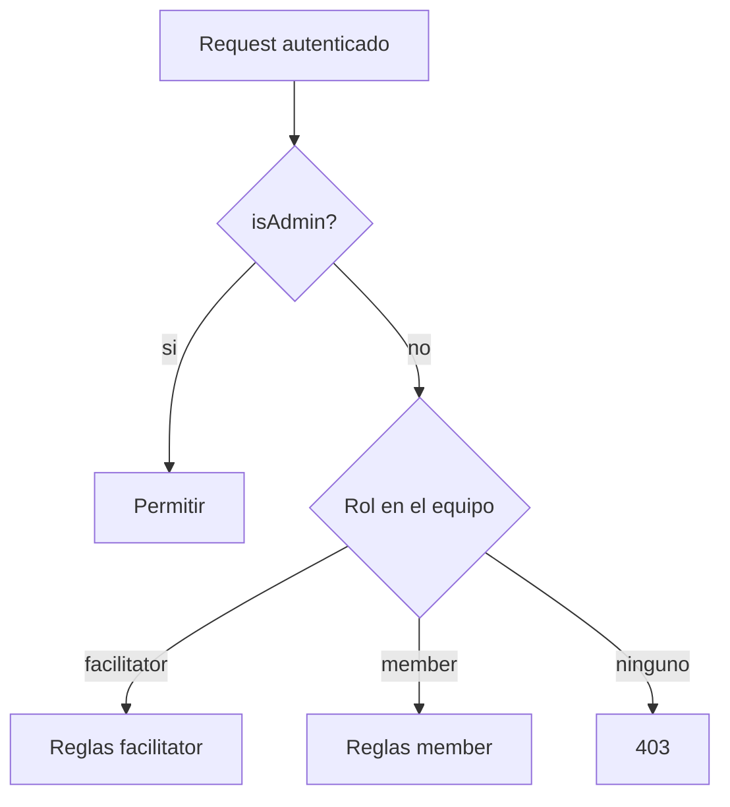

# Roles: admin global + facilitator/member

## Modelo de permisos (cerrado)

| Capacidad | Admin app | Facilitator (del equipo) | Member (del equipo) |
|-----------|-----------|--------------------------|---------------------|
| Equipos CRUD (todos / el propio) | Todos los equipos | Update/delete del suyo | Crear equipo (pasa a facilitator); unirse como member |
| Sacar miembros | Sí (cualquier equipo) | Sí (su equipo) | No |
| Retros crear/editar/borrar | Sí | Sí | No |
| Retros ver/participar | Sí | Sí | Sí |
| Plantillas ver | Sí | Sí (readonly) | Sí (readonly) |
| Plantillas CUD | Sí | No | No |
| Acciones crear | Sí | Sí | Sí |
| Acciones editar/mover/borrar | Todas | Todas del equipo | Solo si `createdById === yo` **o** `ownerId === yo` |
| Borrar usuarios | Sí | No | No |

## Schema + bootstrap del admin

En [`backend/prisma/schema.prisma`](backend/prisma/schema.prisma):

- `User.isAdmin Boolean @default(false)`
- `ActionItem.createdById String?` + relation `createdBy` (para el criterio “quien la creó”)
- Migración Prisma que agrega columnas; backfill de `createdById` = `ownerId` donde exista (mejor esfuerzo para datos viejos)

Seed en [`backend/prisma/seed.ts`](backend/prisma/seed.ts) (corre con `prisma migrate deploy` en el entrypoint):

- Leer `ADMIN_EMAIL` + `ADMIN_PASSWORD` (obligatorios en compose; documentar en [`.env.example`](.env.example))
- Upsert **un solo** admin: si ya existe `isAdmin: true`, actualizar email/passwordHash/name; si no, crear con `isAdmin: true`
- Nunca crear un segundo admin

Registro ([`auth.service.ts`](backend/src/auth/auth.service.ts)): `isAdmin` siempre `false`. Ningún endpoint puede promover a admin.

`/auth/me` y login: exponer `user.isAdmin`. El flag `isFacilitator` (facilitator en algún equipo) se mantiene para UI de equipo, no para plantillas.

## Autorización central

Extender helpers en [`teams.service.ts`](backend/src/teams/teams.service.ts) (o un `AuthzService` fino si conviene):

- `assertAdmin(userId)`
- `isAdmin(userId)` / cache breve en request
- `assertMemberOrAdmin` — member del equipo **o** admin
- `assertFacilitatorOrAdmin` — facilitator del equipo **o** admin
- Reemplazar usos de `assertAnyFacilitator` en plantillas por `assertAdmin`

Admin **no necesita** ser `TeamMember`: bypass de membership en listados y mutaciones de equipos/retros/acciones/miembros.

## Cambios por dominio (API)

### Equipos — [`teams.service.ts`](backend/src/teams/teams.service.ts) / controller

- `list`: admin ve **todos** los equipos; resto solo memberships
- `update` / `delete` / logo / invites / kick / join-requests: `assertFacilitatorOrAdmin`
- Kick: admin puede sacar a cualquiera (salvo salvaguardas actuales de “último facilitator” si aplica; admin puede forzar o reasignar — mantener regla de no dejar equipo sin facilitator salvo que el admin lo acepte borrando el equipo)

### Retros — [`retros.service.ts`](backend/src/retros/retros.service.ts)

- `create`: pasar de `assertMember` a `assertFacilitatorOrAdmin`
- Delete / settings / phase / timer / presenter: ya facilitator → `assertFacilitatorOrAdmin` (bypass sin membership)
- Ver / join / participar: member **o** admin (admin puede entrar a cualquier retro)

### Plantillas — [`templates.service.ts`](backend/src/templates/templates.service.ts) + staging

- GET: cualquier usuario autenticado (sin cambio sustancial)
- POST/PATCH/DELETE + uploads/staging: `assertAdmin` (sacar `assertAnyFacilitator`)

### Acciones — [`actions.service.ts`](backend/src/actions/actions.service.ts) + create-in-retro

- Al crear: setear `createdById = userId` (también en create desde retro/cards)
- `update` / move (status) / `remove`:
  - admin → ok
  - facilitator del equipo → ok
  - member → solo si `createdById === userId || ownerId === userId`
- List: member o admin (admin ve acciones de cualquier equipo vía listado de equipo)

### Usuarios (nuevo ABM)

Nuevo módulo liviano `users` (o endpoints bajo `auth`/`admin`):

- `GET /users` — solo admin (id, email, name, createdAt, isAdmin; sin hash)
- `DELETE /users/:id` — solo admin; **prohibido** borrar si `isAdmin` o si es el propio usuario; cascade ya cubre memberships (`onDelete: Cascade`)

## Frontend

- Modelo `User.isAdmin`; `AuthService` + `ensureAdmin()`; nuevo `adminGuard`
- Rutas plantillas:
  - `/templates` → `authGuard` (todos ven listado readonly)
  - `/templates/new` y editor writable → `adminGuard`
  - Listado: botones crear/editar/borrar solo si `isAdmin`; no-admin puede ver detalle en modo lectura o solo cards sin acciones de escritura
- Rail: link Plantillas para **todos** los usuarios logueados (no solo `isFacilitator`)
- [`team.page.ts`](frontend/src/app/pages/team/team.page.ts): “Nueva retrospectiva” y delete/rename solo facilitator **o** admin
- [`actions.page.ts`](frontend/src/app/pages/actions/actions.page.ts): habilitar drag/edit/delete según la misma regla (facilitator/admin vs creator/owner)
- Nueva página **Usuarios** (`/users`) solo admin: tabla + borrar con confirm; entrada en rail si `isAdmin`
- Equipos `/teams`: admin ve y administra todos; UI reusa panel actual

## Config

- [`.env.example`](.env.example) + `docker-compose` env del servicio `api`:
  - `ADMIN_EMAIL=admin@retrokit.local`
  - `ADMIN_PASSWORD=...` (cambiar en prod)

## Fuera de alcance

- Promoción member↔facilitator vía UI (sigue: creator = facilitator; join = member)
- Auth0 / Google
- Soft-delete de usuarios
