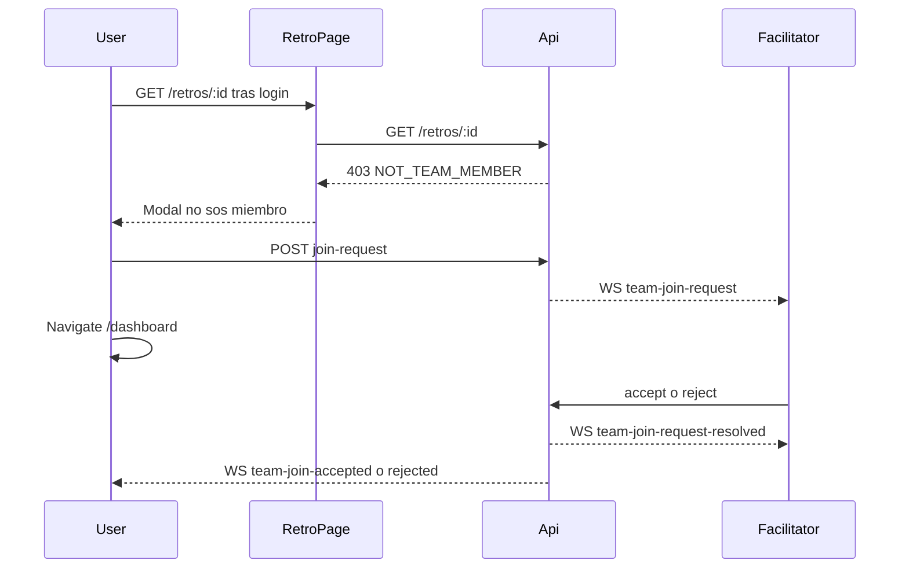

# Solicitud para unirse al equipo desde un enlace de retro

El hang no es un request colgado: tras registrarse, `GET /api/retros/:id` responde **403** `Not a team member` ([`loadAccess`](backend/src/retros/retros.service.ts) → [`assertMember`](backend/src/teams/teams.service.ts)), pero el template solo pinta el error **dentro** de `@if (retro())`. Si `retro` queda `null`, se queda en “Cargando retrospectiva…” ([`retro.page.html`](frontend/src/app/pages/retro/retro.page.html) líneas 540–542).

El join por código de equipo (`POST /teams/join`, `/join-team/:code`) sigue siendo inmediato. Este flujo es solo para quien llega con `/retros/:id` y no es miembro.



## 1. Persistencia: `TeamJoinRequest`

En [`backend/prisma/schema.prisma`](backend/prisma/schema.prisma), modelo solo para pendientes (se borra al resolver para poder volver a pedir):

- `id`, `teamId`, `userId`, `createdAt`
- `@@unique([teamId, userId])`
- Cascade al borrar team o user

Migración nueva al estilo de las existentes (`backend/prisma/migrations/`).

## 2. API de solicitudes

En [`teams.service.ts`](backend/src/teams/teams.service.ts) / [`teams.controller.ts`](backend/src/teams/teams.controller.ts) (`UserAuthGuard`):

- `POST /teams/join-requests` body `{ retroId }` — prueba de acceso = tener el id de la retro. Si no existe: 404. Si ya es miembro: 400. Si ya hay pending: devolver la existente. Crear fila `member` no; solo el request.
- `POST /teams/:teamId/join-requests/:id/accept` — solo facilitador: crear `TeamMember` (`member`) + borrar request.
- `POST /teams/:teamId/join-requests/:id/reject` — solo facilitador: borrar request.

`GET /teams/:id` incluye `joinRequests[]` (user id/name/email) **solo si el caller es facilitador**.

`GET /teams` agrega `pendingJoinCount` en equipos donde el usuario es facilitador (para el badge del Panel).

## 3. 403 estructurado al cargar la retro

En `loadAccess`, si el JWT es `user`, no es participante y no es miembro, no usar el string genérico de `assertMember`. Responder 403 con:

```ts
{ code: 'NOT_TEAM_MEMBER', message, teamId, teamName, pendingRequest }
```

`pendingRequest` evita un segundo request y permite el copy “ya enviaste una solicitud”.

## 4. WebSocket a nivel usuario (no solo retro)

Hoy el socket es solo `retro:{id}` y [`RetroPage`](frontend/src/app/pages/retro/retro.page.ts) hace `disconnect()` al salir: el facilitador en el Panel **nunca** recibiría el aviso.

Extraer un módulo chico `backend/src/realtime/` para no circular `TeamsModule` ↔ `RetrosModule`:

- Mover [`retro.gateway.ts`](backend/src/retros/retro.gateway.ts) + [`retro-events.service.ts`](backend/src/retros/retro-events.service.ts)
- `handleConnection`: si el JWT es `type: 'user'`, `join('user:{sub}')` (JwtModule ya se exporta desde Auth)
- `emitToUser` / `emitToUsers` además de `emit` a `retro:{id}`
- `leave-retro` para no filtrar rooms
- Eventos:
  - `team-join-request` → facilitadores del equipo
  - `team-join-request-resolved` → facilitadores (para cerrar modal / sacar fila)
  - `team-join-accepted` / `team-join-rejected` → el solicitante (toast)

En el frontend, [`socket.service.ts`](frontend/src/app/core/socket.service.ts):

- Conexión persistente mientras haya usuario registrado (reconnect al login, disconnect al logout)
- Retro page: `leaveRetro` en destroy, **no** `disconnect()`

Servicio [`frontend/src/app/core/join-request.service.ts`](frontend/src/app/core/join-request.service.ts): escucha los eventos, expone la solicitud entrante (cola de una) y `accept`/`reject`. Modal global en [`app.ts`](frontend/src/app/app.ts) (mismo patrón `modal-backdrop` que el equipo): “{nombre} quiere sumarse a {equipo}” / Aceptar / Rechazar. **No** abrir ese modal al recargar el Panel (evita spam); el catch-up es la UI persistente.

## 5. UI del solicitante (retro)

En [`retro.page.ts`](frontend/src/app/pages/retro/retro.page.ts) / [`.html`](frontend/src/app/pages/retro/retro.page.html):

- Si 403 `NOT_TEAM_MEMBER`: modal (no el spinner). Copy en vos, como el resto de la retro.
- Acciones: **Volver al panel** → `/dashboard`. **Pedir unirme al equipo** → `POST /teams/join-requests` y también `/dashboard` + toast.
- Si `pendingRequest`: solo copy de espera + volver al panel.
- Otros errores (404, guest mismatch): mensaje + link al panel, nunca “Cargando…” eterno.

## 6. UI del facilitador

**Página del equipo** ([`team.page.ts`](frontend/src/app/pages/team/team.page.ts)): las solicitudes se listan junto a miembros, con opacidad baja, badge tipo “Nuevo · pendiente” y botones Confirmar / Rechazar. Solo las ve el facilitador. Al resolver por WS, sacar la fila (o recargar `getTeam`).

**Panel** ([`dashboard.page.ts`](frontend/src/app/pages/dashboard/dashboard.page.ts)): en la card del equipo, si `pendingJoinCount > 0`, badge visible (ej. “1 solicitud”). Al evento WS, recargar `listTeams()` para que se note sin estar en `/teams/:id`.

El join por código de invitación no cambia.

## Verificación

En el browser, con dos cuentas:

1. Facilitador en Panel (y luego en la retro, y luego fuera de la app).
2. Usuario nuevo abre `/retros/:id` → login/register → modal (no spinner) → pedir unirme → Panel.
3. Facilitador online: modal Aceptar/Rechazar; card del Panel se actualiza; en el equipo la fila semitransparente.
4. Facilitador offline al pedir: al volver, badge en Panel + fila en miembros; aceptar/rechazar desde ahí.
5. Tras aceptar, el solicitante puede reabrir el enlace de la retro y entrar (modal de unirse/espectador existente). El join por código de equipo sigue funcionando igual.
