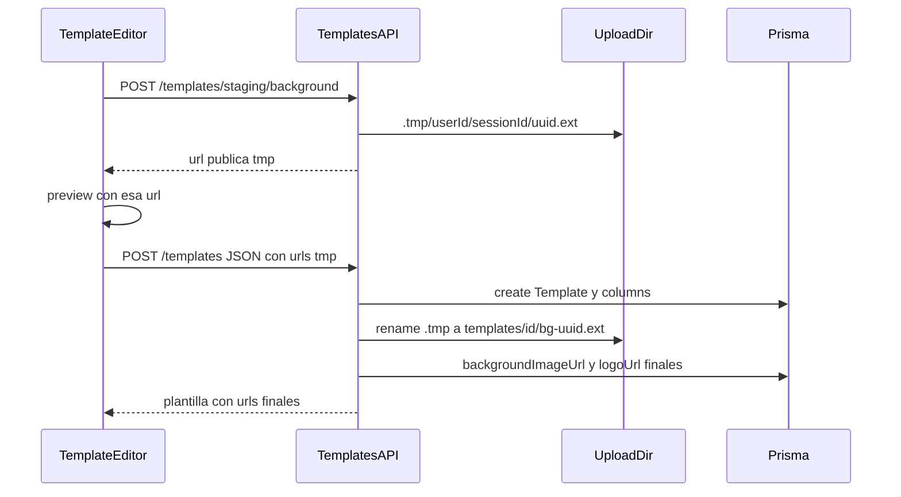

# Staging temporal de imágenes de plantilla

Hoy el editor exige `templateId` / `columnId` porque el backend escribe en `templates/{templateId}/bg-…` y `templates/{templateId}/col-{columnId}-…` y actualiza Prisma en el mismo POST. El plan original lo dejó explícito: en **nueva**, primero guardar. Vamos a romper esa dependencia con staging en disco, como pediste.

Alcance: plantilla nueva **y** columnas nuevas en una plantilla ya guardada. Los endpoints actuales de upload inmediato se mantienen cuando la entidad ya tiene id.

## Flujo



## Disco y URLs

- **Temporal:** `{UPLOAD_DIR}/.tmp/{userId}/{sessionId}/{uuid}.{ext}`
- **Final (igual que hoy):** `{UPLOAD_DIR}/templates/{templateId}/bg-{uuid}.{ext}` y `col-{columnId}-{uuid}.{ext}`
- **URL pública del staging:** `/api/uploads/tmp/{userId}/{sessionId}/{uuid}.{ext}`

`sessionId` lo genera el editor al entrar (`crypto.randomUUID()`). Así cada pestaña tiene su carpeta y al salir no borramos el staging de otra pestaña del mismo usuario.

`serve-static` ignora segmentos que empiezan con `.` (`dotfiles: ignore`). Por eso el folder en disco es `.tmp` (como pediste) pero el prefix HTTP es `/api/uploads/tmp/`, montado aparte en [`backend/src/main.ts`](backend/src/main.ts):

```ts
app.useStaticAssets(resolve(uploadDir, '.tmp'), {
  prefix: '/api/uploads/tmp/',
  setHeaders: /* mismo SVG attachment que el mount actual */,
});
```

El volumen Docker `uploads_data` ya cubre esto (vive bajo `/app/uploads`).

## Backend

**[`backend/src/uploads/uploads.service.ts`](backend/src/uploads/uploads.service.ts)** — métodos nuevos:

- `saveStaging(userId, sessionId, file, kind: 'background' | 'logo')` — misma validación `assertBackground` / `assertLogo`; mkdir `.tmp/{userId}/{sessionId}`; nombre `randomUUID()`. `sessionId` tiene que ser un UUID (rechazar path traversal).
- `assertOwnedStagingUrl(userId, publicUrl)` — solo acepta `/api/uploads/tmp/{userId}/…` (anti path-traversal, no promover archivos ajenos).
- `promoteStaging(userId, publicUrl, templateId, prefix)` — `rename` al path final y devolver la URL `/api/uploads/templates/…`. Si el archivo ya no está, `BadRequestException`.
- `deleteStaging(userId, publicUrl)` — unlink si es propio.
- `deleteStagingSession(userId, sessionId)` — `rm` de `.tmp/{userId}/{sessionId}` (salida del editor sin guardar).
- Tope por usuario: al subir, si `.tmp/{userId}` supera **20 archivos** o **25 MB**, borrar los más viejos (por `mtime`) hasta volver al límite. Evita llenar el disco en una sola sesión aunque no cierre el tab.
- `purgeExpiredStaging(maxAgeMs = 6h)` — barrido por `mtime` de todo `.tmp`. Se corre en `onModuleInit`, **después de cada upload**, y cada **15 min** con `setInterval` en el service (`OnModuleDestroy` limpia el timer). Sin `@nestjs/schedule`. El TTL es red de seguridad (crash, `keepalive` que no llegó, tab colgado); no es el camino principal de borrado.

**Controller dedicado** [`backend/src/templates/templates-staging.controller.ts`](backend/src/templates/templates-staging.controller.ts) (`@Controller('templates/staging')`) para no chocar con `:id`:

- `POST /api/templates/staging/background` y `POST /api/templates/staging/logo` — multipart `file` + campo `sessionId`, `UserAuthGuard` + `assertAnyFacilitator`. Respuesta `{ url }`.
- `DELETE /api/templates/staging?url=…` — borrar un tmp propio (reemplazo / quitar / columna eliminada antes de guardar).
- `DELETE /api/templates/staging/sessions/:sessionId` — borrar la carpeta de esa sesión si es del usuario.

**Create/update** en [`backend/src/templates/templates.service.ts`](backend/src/templates/templates.service.ts):

1. Crear/actualizar plantilla y columnas **sin** copiar URLs del cliente a Prisma (el cliente no puede asignar un `templates/…` ajeno).
2. Si `dto.backgroundImageUrl` es staging propio → `promoteStaging(…, id, 'bg')` y `update` de `backgroundImageUrl`.
3. Recorrer `dto.columns` por índice/`position` (mismo orden que `orderBy: position`). Si `logoUrl` es staging → `promoteStaging(…, id, 'col-'+columnId)` y setear `logoUrl` + `icon: null`.
4. Si promote falla a mitad de camino, la plantilla igual existe; devolver error claro. Los tmp no promovidos los limpia el delete de sesión al salir o el TTL.

DTOs en [`backend/src/templates/dto/templates.dto.ts`](backend/src/templates/dto/templates.dto.ts): `backgroundImageUrl?` en create/update; `logoUrl?` en `TemplateColumnInputDto`. `ValidationPipe` tiene `forbidNonWhitelisted: true`, hay que declararlos (`@IsOptional` `@IsString`). La autorización real de la URL queda en el service, no en un regex frágil.

Los POST/DELETE actuales `:id/background` y `:id/columns/:columnId/logo` **no se tocan**.

## Frontend

[`frontend/src/app/core/api.service.ts`](frontend/src/app/core/api.service.ts): `uploadStagingBackground`, `uploadStagingLogo`, `deleteStaging`, `deleteStagingSession`.

[`frontend/src/app/pages/templates/template-editor.page.ts`](frontend/src/app/pages/templates/template-editor.page.ts):

- Quitar hints/disabled de “Guardá la plantilla…” y el `@if (col.id)` del input de logo.
- Al entrar, `sessionId = crypto.randomUUID()`. Helper `isStagingUrl`. Si hay `templateId` (fondo) o `col.id` (logo) → upload inmediato como ahora. Si no → staging con ese `sessionId`, guardar la URL en `backgroundImageUrl` / `col.logoUrl` para el preview (`` y CSS ya consumen esa URL).
- Al reemplazar o quitar un staging: `deleteStaging` del anterior.
- `payload()` manda `backgroundImageUrl` y `columns[].logoUrl` **solo** si son staging; los persistidos siguen viajando por los endpoints de archivo.
- `removeColumn` / `pickEmoji` / `clearSymbol` / `clearBackground` en plantilla nueva: limpiar tmp local + DELETE staging; no llamar a los DELETE `:id` si no hay id.
- **Al salir del editor** (`ngOnDestroy` + `pagehide`): si quedaron URLs staging (no se guardó, o sobraron archivos no promovidos), `DELETE /templates/staging/sessions/:sessionId` con `fetch(..., { keepalive: true })` y el Bearer del `AuthService`. `sendBeacon` no sirve: no manda `Authorization`. Tras un save exitoso los archivos promovidos ya no están en `.tmp`; el delete de sesión solo limpia lo que quedó.
- Toast de alta: `"Plantilla creada"` (ya no “Ya podés subir fondo y logos”).

## Limpieza de temporales (capas)

El caso “entra, sube muchas, se va” no puede depender solo de un TTL largo.

1. **Inmediato:** reemplazar / quitar imagen o columna borra ese archivo tmp.
2. **Sesión:** al abandonar el editor se borra `.tmp/{userId}/{sessionId}` entero. Es el camino principal para no dejar basura.
3. **Tope:** máximo 20 archivos / 25 MB por usuario en `.tmp`. Si se pasa, se eliminan los más viejos al siguiente upload.
4. **TTL 6 h + intervalo 15 min:** por si el browser mató el tab antes del `keepalive`, o el API se reinició. No tocamos atime (el estático no “refresca” el TTL); si alguien deja el editor abierto más de 6 h sin guardar, el preview puede 404 y hay que volver a subir — aceptable frente a disco lleno.

Promote (`rename`) saca el archivo de `.tmp`, así que guardar no depende de que el TTL no se haya disparado en el mismo instante.

Crop modal y validación MIME/tamaño no cambian: el staging corre **después** del recorte, igual que el upload actual.

## Fuera de alcance

- No hay migración Prisma: las URLs tmp no se persisten.
- Imágenes de tarjetas de retro no se tocan.
- No hace falta auth en el GET estático (igual que `templates/` y `cards/`; el UUID es opaco).

## Verificación

Rebuild `api` y `web` (Compose sin bind mounts). En `http://localhost:8090`:

1. `/templates/new`: subir fondo + logos de columnas, ver preview, guardar → archivos en `templates/{id}/`, preview y listado con URLs finales.
2. Editar plantilla: agregar columna, subir logo **antes** de guardar, guardar → el logo queda en esa columna.
3. Reemplazar/quitar staging antes de guardar → el archivo viejo desaparece de `.tmp`.
4. Subir fondo+logos en `/templates/new`, volver al listado **sin guardar** → la carpeta de sesión se borra (inspeccionar volumen o 404 del preview).
5. Regresión: editar plantilla existente, cambiar fondo/logo de columna con id (upload inmediato) y crear una retro para confirmar el snapshot.
