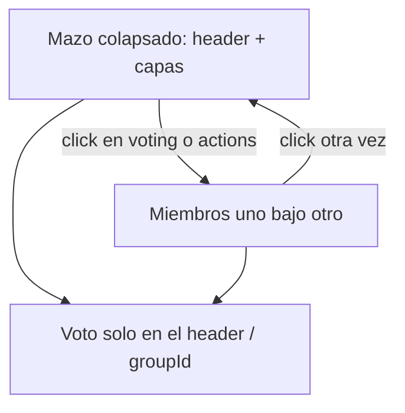
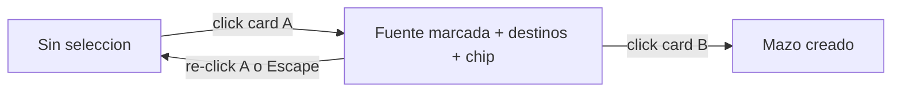

# Tarjetas agrupadas solapadas (estilo Scrumlr)

Hoy el backend ya guarda cada card por separado (`Card.groupId` → `CardGroup`). El texto feo sale del cliente: [`cardsForColumn()`](frontend/src/app/pages/retro/retro.page.ts) une contenidos con ` · ` y el template pinta un solo `
`.

No hace falta fusionar textos. El grupo se muestra como **mazo**: al frente la principal (su texto, imagen y autor), detrás 1–2 capas vacías offset para delatar el stack. Al desplegar, cada miembro es un sticky completo.

Referencia visual: [Scrumlr](https://scrumlr.io/) (mazo en el board; al presentar, las notas se ven por separado).

**Dónde vive cada cosa:** este plan es el board (mazo colapsado, expandir, votar el header, chip de agrupado). El overlay “todos ven lo mismo” queda en [modo presentación](modo_presentacion_ce7b5dff.plan.md): **una slide por grupo**, con **todos los miembros a la vista** (no texto unido). No implementamos el overlay acá; el spec de esa slide ya está en ese plan.

## Qué es la principal (header)

Es la card **target** del agrupado (la segunda que clickeás), igual que “soltar encima” en Scrumlr. Las que se suman después quedan detrás.

Sin campo nuevo: en [`groupCards()`](backend/src/retros/retros.service.ts), al unir `source` al grupo de `target`, setear `source.position = max(posiciones del grupo, target.position) + 1` para que el target quede con la posición más baja. En el cliente, miembros ordenados por `position`; el primero es el header.

Votos: sin cambio de API. Siguen yendo a `groupId` ([`setVote`](backend/src/retros/retros.service.ts) ya rechaza votar un `cardId` agrupado). En UI, `+/−` y el badge de votos viven **solo en el header**, nunca en los miembros desplegados.

## Board: dejar de concatenar

En [`cardsForColumn()`](frontend/src/app/pages/retro/retro.page.ts):

- No más `texts.join(' · ')` ni `imageUrls` mezclados.
- Cada grupo: `{ ...header, isGroup: true, groupId, groupSize, members }` donde `members` son las cards reales (header primero).
- El `content` / `imageUrl` / `authorName` del ítem son **solo los del header**.

Template ([`retro.page.html`](frontend/src/app/pages/retro/retro.page.html)): si `isGroup`, envolver en `.sticky-stack` en lugar de un `<article class="sticky">` suelto.

Agrupar un mazo con otra card: si la selección actual es un grupo, llamar `groupCards(clickedId, headerId)` para que la otra card **entre al grupo** (hoy, seleccionar el mazo y después una suelta mueve solo `gCards[0]` y puede partir el grupo).

## UI del mazo

Estilos en [`retro.page.scss`](frontend/src/app/pages/retro/retro.page.scss) (no hay stack hoy):

- **Colapsado:** header es el sticky real. Hasta 2 capas detrás (`translate(6px, 6px)`, `translate(12px, 12px)`), mismo radio/sombra, `pointer-events: none`, `aria-hidden`. Altura del wrapper = header + offset. Máximo 2 capas aunque haya 5 miembros.
- **Desplegado** (`.expanded`): los miembros pasan a flujo vertical con gap; transición corta de `transform` / `margin` (200–300ms). Cada miembro muestra su texto, imagen y autor.
- Estado local: `expandedGroupIds` (Set). No se sincroniza por socket; cada persona abre el suyo.
- Autores: en colapsado, solo el del header (los avatares solapados de Scrumlr quedan para el plan de [avatares](.cursor/plans/avatares_meme_1110fe4b.plan.md)). Opcional: un `+N` discreto si `groupSize > 1`.
- `canManageCard` sigue en false para grupos (no editar/borrar miembros agrupados).

## Interacción por fase

- **Agrupar:** el mazo se ve solapado (sin concatenar). Click en el header sigue siendo seleccionar para agrupar. Un control chico (chevron o el `+N`) despliega para leer sin robar el tap de agrupado.
- **Votar:** click en el mazo (no en `+/−`) despliega/colapsa. `+/−` con `stopPropagation`, visibles solo en el header, bound a `groupId` como ahora.
- **Plan de acción:** igual, click despliega/colapsa; el badge de votos queda en el header.

Click de nuevo en el header (o el chevron) cierra. No hace falta ungroup ni drag-and-drop.

## Modo “agrupando”: el primer click tiene que verse

El two-tap se queda. Lo que falta es **decir que el siguiente click une**. Hoy solo hay `.sticky.selected` (marco `--color-brand` + `--color-focus-ring`) y el hint estático del meta-bar (“Selecciona dos tarjetas…”). No se distingue la fuente de los destinos.

Mientras `selectedCardId` esté set (solo fase `grouping` + participante):

**Chip flotante persistente** (no [`ToastService`](frontend/src/app/core/toast.service.ts): ese se apaga solo a los ~3s). Reusar el patrón de [`.copy-toast`](frontend/src/app/pages/retro/retro.page.scss) (`position: fixed`, centro abajo, `role="status"` `aria-live="polite"`), visible **todo el rato** que hay selección. Texto: **“Elegí otra tarjeta para agrupar”** y, más chico, “Click de nuevo en esta para cancelar”. Al agrupar o cancelar, desaparece.

El hint del meta-bar puede pasar al mismo mensaje cuando hay selección; el chip es el que se ve sin mirar el header.

**Dos marcos, misma paleta** ([`styles.scss`](frontend/src/styles.scss)):

- **Fuente** (la clickeada): se mantiene `.selected` — `border-color: var(--color-brand)` (`#008ace`) + ring `--color-focus-ring`. Es el foco.
- **Destinos** (el resto de stickies/mazos agrupables): clase `.group-target` — marco `--color-sky-mid` (`#7ec8e8` claro / `#3d6a85` oscuro), más claro que brand, más un ring suave (`color-mix` con `--color-sky-mid`). Cursor `pointer`. Así se lee “estas son las que podés unir”.
- Composer, cards hidden y la fuente no llevan `.group-target`.

Cancelar: re-click en la fuente (ya existe) y **Escape**. Al completar el group, `selectedCardId = null` y se limpian chip y marcos.

## Fuera de alcance

- Overlay de presentación: alcance y UI de la slide de grupo en [modo presentación](modo_presentacion_ce7b5dff.plan.md).
- Report: ya lista cada card por separado; no concatenar ni apilar.
- Ungroup, merge explícito de dos mazos, votos por miembro.
- Avatares solapados.

## Verificación (browser)

- Agrupar dos comentarios: mazo de 2, se lee solo el texto del target; el otro no está pegado con ` · `.
- Tercer comentario al mazo: 3 miembros, 2 capas detrás.
- Primer click: chip flotante visible; fuente en azul brand; el resto en sky-mid. Segundo click agrupa y se apaga el modo. Re-click o Escape cancela.
- Agrupar: click selecciona el mazo; el chevron deja leer los miembros; otra card entra al mismo grupo.
- Votar: desplegar, `+/−` solo en el header; el total es de grupo; no se puede votar un miembro.
- Plan de acción: mazo solapado, click anima el despliegue, cada texto en su sticky, badge de votos en el header.
- Recargar: el header sigue siendo el target original.
