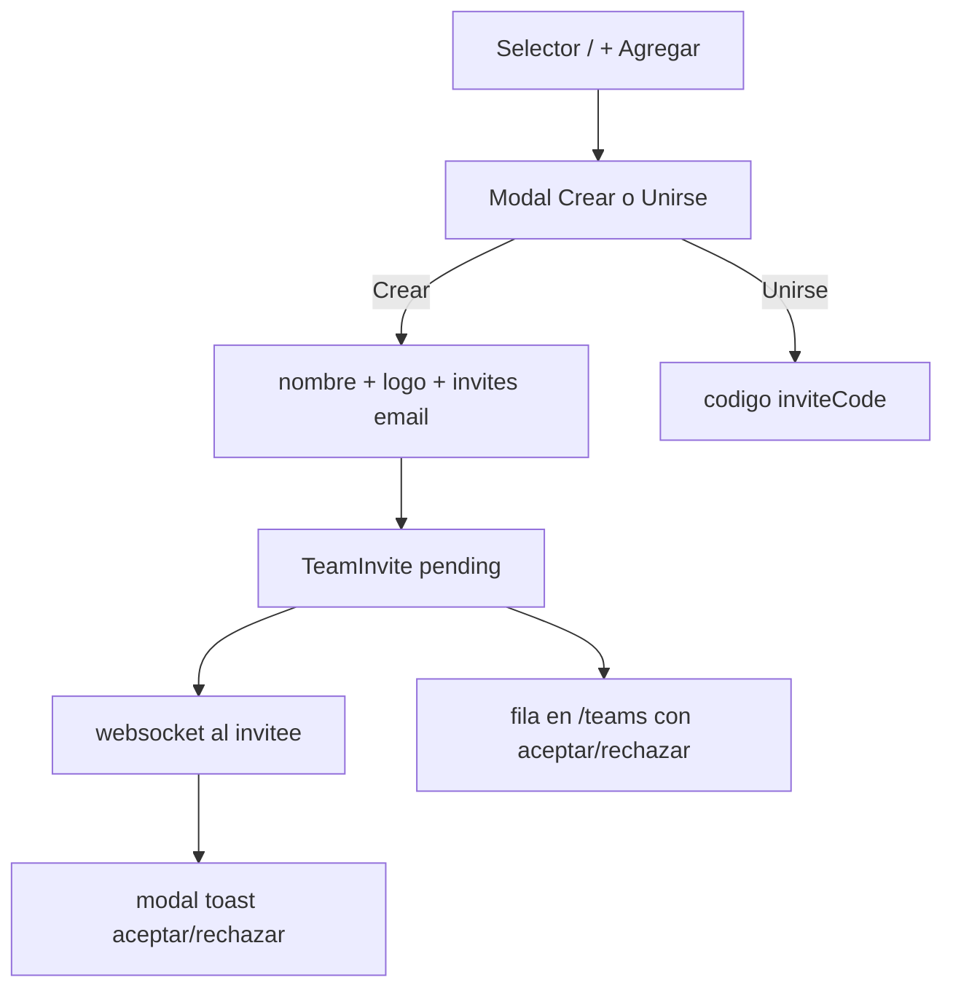

# Panel por equipo + Administrar equipos

## Decisiones cerradas

- Invitación por email = **pendiente de aceptación** (espejo de join-requests), con **toast/modal en tiempo real vía websocket** y también **aceptar/rechazar en el listado** de Administrar equipos.
- **Miembros** vive en ruta dedicada `/teams/:id/members` (restaurada en la rail en el plan de polish); admin de equipos en `/teams`.
- Panel = **contexto del equipo activo** (no overview multi-equipo).
- Logo de equipo = **upload de imagen** reusando [`UploadsService`](backend/src/uploads/uploads.service.ts) (mismo patrón que logos de plantilla).
- `removeMember` **no** elimina el `User` (solo membership).
- Sin equipos: home de onboarding; rail oculta hasta tener al menos un equipo.

## Enmiendas post-implementación

Ver [nav_polish_retros_a22b4c6d.plan.md](nav_polish_retros_a22b4c6d.plan.md): Miembros+Equipos en rail, invites 3 vías, pending cancel, onboarding, accept → Panel, salir de retro al origen.

## Nueva IA de la rail

```
Logo (+ expand fuera / abajo, sin tapar logo)
[Selector equipo]  → popover: lista + "+ Agregar equipo" + link a Administrar
─────────────────
Panel              → /dashboard  (scoped al activeTeam)
Retros             → /teams/:id  (solo historial + Nueva retrospectiva)
Acciones           → /teams/:id/actions
Equipos            → /teams      (NUEVA admin)
Plantillas*        → /templates
─────────────────
Tema · Avatar
(+ Salir solo si expanded)
```

Sin item **Miembros**.

## Flujos



## Backend

### Schema ([`schema.prisma`](backend/prisma/schema.prisma))

- `Team.logoUrl String?`
- Nuevo modelo `TeamInvite`: `id`, `teamId`, `inviterId`, `inviteeId`, `status` (`pending`|`accepted`|`rejected`), timestamps; unique `(teamId, inviteeId)` where pending.

### APIs ([`teams.controller.ts`](backend/src/teams/teams.controller.ts) / service)

- `PATCH /teams/:id` ya existe (nombre); exponer en frontend + permitir `name`.
- `POST /teams/:id/logo` + `DELETE` — multer + `UploadsService.save…` (nuevo helper team logo).
- Crear equipo: aceptar `name` + opcional logo (staging promote o upload post-create) + lista de `inviteeIds`/`emails`.
- `GET /users/search?email=` (auth) — match exacto o prefijo de email de usuarios registrados (mínimo: exact case-insensitive); no devolver password.
- `POST /teams/:id/invites` `{ email }` — crea `TeamInvite` pending; emite evento socket al invitee.
- `GET /teams/invites/incoming` — pendientes del usuario actual.
- `POST /teams/invites/:id/accept|reject` — accept crea `TeamMember` role member; reject cierra; emite resolved.
- Extender `GET /teams` para incluir `pendingInvite?: { id }` cuando el usuario aún no es miembro pero tiene invite (o endpoint separado consumido por la página Equipos).

Websocket: reusar patrón de [`teams.service.ts`](backend/src/teams/teams.service.ts) (`emitToUsers`) con eventos `team-invite` / `team-invite-resolved`.

## Frontend

### Shell / rail ([`app-nav-rail.component.ts`](frontend/src/app/shared/app-nav-rail.component.ts))

- Quitar Miembros.
- Agregar **Equipos** → `/teams`.
- Popover: footer **"+ Agregar equipo"** (abre modal) además de ir a admin; quitar dependencia de crear desde Panel.
- **Colapsada:** no mostrar logout; **expand** no tapa el logo — control de expand/collapse en el borde superior del `main` (chevron flotante tipo Neatro), no encima del brand.
- Expanded: avatar + nombre + salir como ahora.

### Modal compartido `TeamCreateJoinModal`

Tabs: **Crear** | **Unirse**.

- Crear: nombre, upload logo (preview), buscador email → chips de usuarios a invitar (pending al guardar).
- Unirse: campo código → `joinTeam` existente.
- Abrible desde selector y desde `/teams`.

### Nueva página [`/teams`](frontend/src/app/pages/teams/teams.page.ts)

- Listado: logo/inicial, nombre, rol, miembros count; acciones editar (nombre/logo), invitar (email), borrar (facilitador), copiar código.
- Filas de **invitaciones recibidas** con tilde/cruz.
- Botón Create Team → mismo modal.
- Ruta en [`app.routes.ts`](frontend/src/app/app.routes.ts).

### Panel ([`dashboard.page.ts`](frontend/src/app/pages/dashboard/dashboard.page.ts))

- Quitar sección **Equipos** y formularios crear/unirse.
- Scoped a `ActiveTeamService.activeTeamId`: título con nombre del equipo (o “Elegí un equipo”).
- **Retros recientes** solo de ese equipo.
- Reemplazar **Acciones pendientes** por **Por caducar** (misma lógica `dueSoonDays = 14` que en team page).
- Empty state si no hay equipo activo.

### Hub Retros ([`team.page.ts`](frontend/src/app/pages/team/team.page.ts))

- Solo: título equipo (+ star), **Nueva retrospectiva**, historial de retros.
- Quitar: Miembros, Invitar, Borrar equipo, Por caducar, link Tablero (ya no estaba).
- Delete/invite/members viven en `/teams`.

### Invitaciones UI

- Nuevo `TeamInviteService` (espejo de [`JoinRequestService`](frontend/src/app/core/join-request.service.ts)): cola + modal aceptar/rechazar en [`app.ts`](frontend/src/app/app.ts).
- Listado en `/teams` también resuelve invites.

## Fuera de alcance

- Email transaccional real (SMTP).
- Org/billing, analytics.
- Cambiar chrome de retro en vivo.

## Verificación

Rebuild `web` + `api`. Probar: crear equipo con logo e invite → invitee ve modal y tilde/cruz; Panel muestra retros/por caducar del equipo activo; hub solo retros; rail colapsada sin logout y expand sin tapar logo. URL: `http://localhost:8090`.
