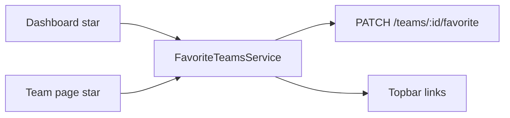

# Teams destacados (favoritos personales)

## Decisión

- Preferencia **por usuario** en la membresía (`TeamMember`), no en `Team`.
- Máximo **3** destacados por usuario; al intentar un 4.º → `400` con mensaje claro.
- Topbar: links `icono + nombre` a `/teams/:id`, **después** de Plantillas (o después de Panel si no hay Plantillas).
- Toggle en **dashboard** (cards) y **página del team** (header).

## Datos

En [`backend/prisma/schema.prisma`](backend/prisma/schema.prisma), `TeamMember`:

```prisma
favoritedAt DateTime?
```

- `null` = no destacado; set = destacado (orden en nav = más reciente primero, o por `favoritedAt` asc — se usa **asc** para estabilidad: el primero que destacaste queda a la izquierda).
- Migración Prisma nueva.
- Al salir del team (`removeMember` / leave implícito por delete membership): el flag se va con la fila (Cascade).

## API

Archivos: [`teams.controller.ts`](backend/src/teams/teams.controller.ts), [`teams.service.ts`](backend/src/teams/teams.service.ts), DTO nuevo.

- `PATCH /teams/:id/favorite` body `{ favorited: boolean }` (cualquier miembro del team).
  - `favorited: true`: si ya tiene 3 con `favoritedAt != null` y este no está → `BadRequestException('Podés destacar hasta 3 equipos')`.
  - Setea/limpia `favoritedAt`.
- Extender `listForUser` y `getOne` para devolver `favorited: boolean` (derivado de `favoritedAt`) en el payload del team / membership del usuario actual.
- En `listForUser`, incluir `favoritedAt` en el `select` del membership y mapear `favorited`.

Sin endpoint aparte de listado: la topbar reusa `GET /teams` filtrando `favorited`.

## Frontend — modelo y cliente

- [`TeamSummary`](frontend/src/app/core/models/index.ts) / `TeamDetail`: `favorited?: boolean`.
- [`api.service.ts`](frontend/src/app/core/api.service.ts): `setTeamFavorite(id, favorited: boolean)`.

## Servicio compartido topbar

Nuevo [`frontend/src/app/core/favorite-teams.service.ts`](frontend/src/app/core/favorite-teams.service.ts):

- Signal `favorites` (`{ id, name }[]`, máx. 3).
- `load()` desde `listTeams()` filtrando `favorited`, ordenados.
- `setFavorite(teamId, favorited, name?)` → API → actualiza signal (y propaga a callers).
- Se carga al login / cuando `auth.isUser()`; se limpia al logout.

Así dashboard, team page y [`app.ts`](frontend/src/app/app.ts) comparten el mismo estado sin recargar la página.

## UI



1. **Topbar** ([`app.ts`](frontend/src/app/app.ts)): después del bloque Plantillas, `@for` de `favoriteTeams.favorites()` → `nav-link` a `/teams/:id` con icono de equipo (users) + nombre. Mismo patrón que Panel/Plantillas (`routerLinkActive`). En mobile (`≤720px`), donde hoy se ocultan labels: para estos links **mantener nombre truncado** (p. ej. max ~10ch) o inicial, para no tener N iconos idénticos.

2. **Dashboard** ([`dashboard.page.ts`](frontend/src/app/pages/dashboard/dashboard.page.ts)): botón estrella en cada `team-card` con `$event.preventDefault(); $event.stopPropagation()` para no navegar. Estado visual filled/outline según `team.favorited`. Toast/error si el API rechaza el 4.º. Opcional: ordenar la lista con destacados primero (sí: destacados arriba, resto por `createdAt`).

3. **Team page** ([`team.page.ts`](frontend/src/app/pages/team/team.page.ts)): botón estrella en `.header-actions` (junto a Nueva retrospectiva / Tablero). Mismo toggle + feedback de límite.

## Fuera de alcance

- Destacar a nivel “global/org”.
- Reordenar manualmente los 3 en la barra (orden = `favoritedAt` asc).
- Favoritos en localStorage sin backend.

## Verificación

- Destacar 1–3 → aparecen en topbar; click entra al team.
- 4.º → error, no cambia UI.
- Quitar estrella → desaparece de la barra al toque.
- Dashboard y team page reflejan el mismo estado.
- Usuario sin Plantillas (no facilitator) igual ve sus destacados después de Panel.
- Rebuild `web` + `api` (Docker) al implementar.
