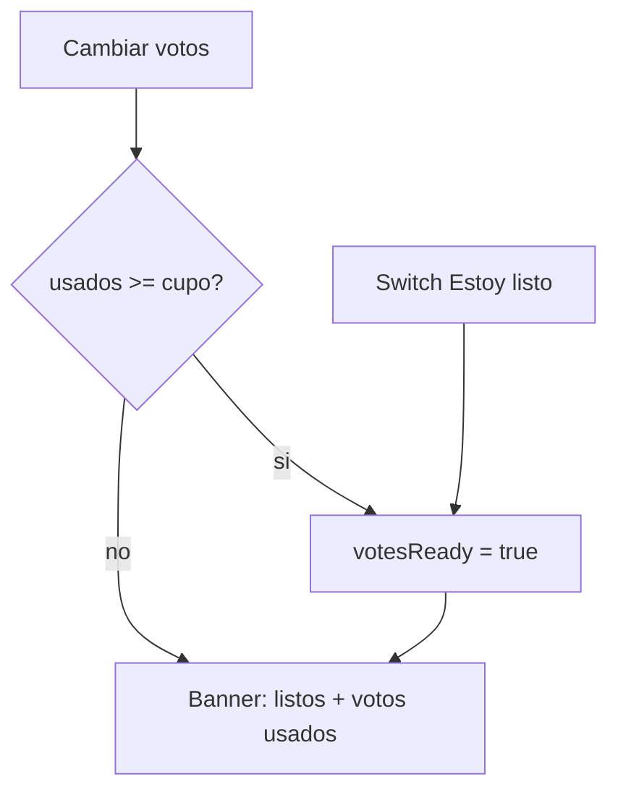

# Orden original al votar + listos de votos

Hoy, en [`cardsForColumn()`](frontend/src/app/pages/retro/retro.page.ts), las tarjetas se reordenan por votos tanto en `voting` como en `actions`. El dropdown de ordenar solo aparece en plan de acción, así que en votar siempre gana el default `most`. Eso filtra popularidad en vivo (las stickies saltan) y no aporta: el ranking sirve cuando ya se discute el plan.

El meta-bar de votar solo muestra `Votos restantes: X / Y`. No hay progreso de equipo ni “Estoy listo”, a diferencia de comentarios ([`commentsReady`](backend/prisma/schema.prisma) + banner `Listos: X / Y`).

## 1. Orden: votar vs plan de acción

En [`cardsForColumn()`](frontend/src/app/pages/retro/retro.page.ts), aplicar el sort **solo** si `r.status === 'actions'`. En `voting` dejar el orden de `position` / grupos (el mismo que en agrupar).

El dropdown “Más votados / Menos / Original” no se toca: sigue solo en plan de acción. En votar las tarjetas **no** muestran el total del equipo (solo `mis votos / max por tarjeta`); eso se mantiene para no filtrar el ranking.

## 2. Listos de votos (espejo de comentarios)

Mismas reglas que el plan [Listo al completar comentarios](.cursor/plans/ready_comments_toggle_6e4f63ce.plan.md):

- El check del banner usa **listo**, no “puso al menos 1 voto”. El número entre paréntesis es votos **usados**.
- Switch **Estoy listo** junto al cupo personal. Se puede marcar antes de gastar todos.
- **Auto:** al votar, si `myVoteTotal >= votesPerParticipant`, `votesReady = true`.
- `votesPerParticipant` siempre tiene valor (default 5): siempre hay auto al agotar el cupo. No hay caso “ilimitado”.
- **Bajar votos no te saca de listo.** Si ya marcaste o te auto-marcó, seguís listo hasta apagar el switch.
- Si llegaste al cupo, el switch queda **prendido y deshabilitado** (no podés votar más, no tiene sentido apagarlo).
- Copy del banner: `Listos: X / Y · ¡Todos listos!` + chips `✓/○ Nombre (votosUsados)`.

**Contador de votos totales** (lo que comentarios no tiene, porque el max de comentarios puede ser null):

- Personal: `Tus votos: {myVoteTotal} / {votesPerParticipant}` (usado / cupo, como comentarios; reemplaza “Votos restantes”).
- Equipo: `Votos: {sumaUsados} / {participantes × votesPerParticipant}` en el mismo banner.

`votesRemaining` se sigue usando para deshabilitar el `+`.

## 3. Backend

- [`backend/prisma/schema.prisma`](backend/prisma/schema.prisma): `Participant.votesReady Boolean @default(false)` + migración `20260910120000_votes_ready` (mismo estilo que [`20260909150000_comments_ready`](backend/prisma/migrations/20260909150000_comments_ready/migration.sql)).
- [`getBoard()`](backend/src/retros/retros.service.ts): armar `voteProgress` paralelo a `commentProgress`:
  - por persona: `participantId`, `name`, `voteCount`, `isReady: p.votesReady`
  - `ready` / `total` / `allDone`
  - `votesUsed` / `votesCapacity`
  - `me.votesReady`
- [`setVote()`](backend/src/retros/retros.service.ts): después de persistir, si el total del participante llega al cupo y aún no está listo, setear `votesReady` y emitir `votes-ready-changed`. El `votes-updated` ya recarga el board en otros clientes.
- Extender [`setCommentsReady`](backend/src/retros/retros.service.ts) / `PATCH /retros/:id/me/ready`:
  - fases `comments` | `grouping` → `commentsReady` (igual que hoy)
  - fase `voting` → `votesReady`
  - si `ready === false` y ya está al cupo de votos, rechazar (el switch estará disabled)
  - emitir `votes-ready-changed` en el caso votos
- No resetear `votesReady` al cambiar de fase: cada flag es de su etapa.

## 4. Frontend

- Modelos en [`frontend/src/app/core/models/index.ts`](frontend/src/app/core/models/index.ts): `VoteProgress` / `VoteProgressParticipant`, `me.votesReady`, `Participant.votesReady`.
- [`api.service.ts`](frontend/src/app/core/api.service.ts): el mismo `setCommentsReady` / `PATCH .../me/ready` sirve; el backend decide el campo según la fase. Opcional: alias `setReady` si queda más claro en el page.
- [`retro.page.html`](frontend/src/app/pages/retro/retro.page.html) / [`.ts`](frontend/src/app/pages/retro/retro.page.ts) / [`.scss`](frontend/src/app/pages/retro/retro.page.scss):
  - Reutilizar clases `.comment-progress` / `.ready-toggle` / `.person` (mismo look).
  - `readyLocked()`: en comentarios, cupo de comentarios; en votar, `myVoteTotal >= votesPerParticipant`.
  - Escuchar `votes-ready-changed` y recargar (igual que `comments-ready-changed`).

## 5. Verificación (browser)

- En votar, las tarjetas no saltan al votar; en plan de acción sí se ordenan por más votados y el dropdown sigue andando.
- 1/5 votos no marca listo; el switch sí; 5/5 auto-prende y bloquea el switch.
- Banner: `Votos: usados / capacidad` y chips con el conteo de cada uno.
- Otro cliente ve el cambio en vivo; bajar un voto no apaga listo hasta que lo apagues vos (si no estás al cupo).
